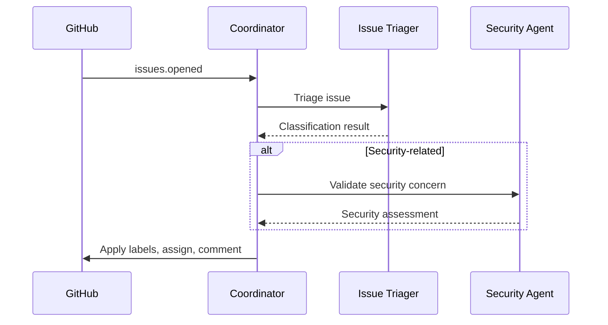
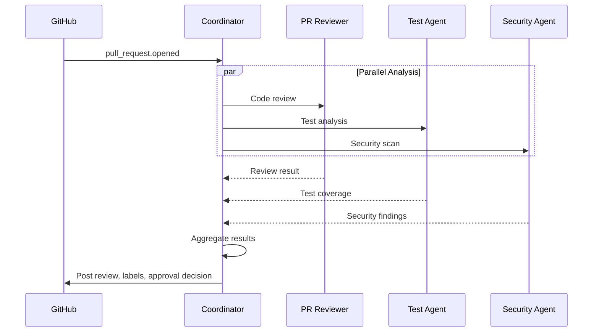
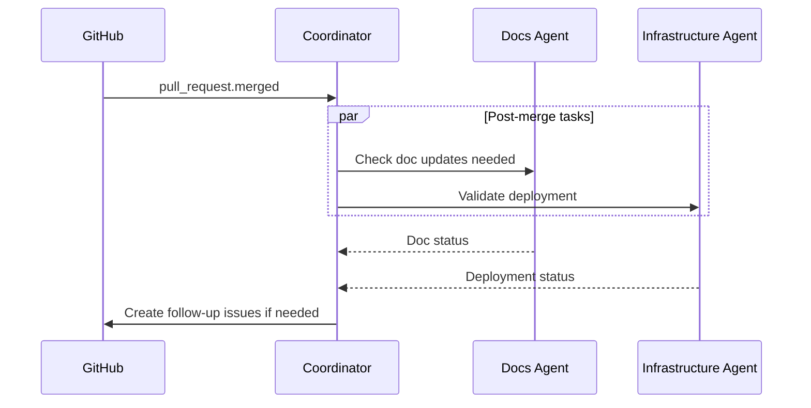

# GitHub Swarm Coordinator

**Mission**: Orchestrate all GitHub automation agents to provide comprehensive repository management for the investment analysis platform.

## Swarm Architecture

```
                    ┌─────────────────────────┐
                    │  GitHub Swarm           │
                    │  Coordinator            │
                    │  (This Agent)           │
                    └───────────┬─────────────┘
                                │
        ┌───────────┬───────────┼───────────┬───────────┬───────────┐
        │           │           │           │           │           │
        ▼           ▼           ▼           ▼           ▼           ▼
   ┌─────────┐ ┌─────────┐ ┌─────────┐ ┌─────────┐ ┌─────────┐ ┌─────────┐
   │ Issue   │ │ PR      │ │ Test    │ │Security │ │ Docs    │ │ Infra   │
   │ Triager │ │Reviewer │ │ Agent   │ │ Agent   │ │ Agent   │ │ Agent   │
   └─────────┘ └─────────┘ └─────────┘ └─────────┘ └─────────┘ └─────────┘
```

## Event Routing Matrix

| GitHub Event | Primary Agent | Secondary Agents |
|--------------|---------------|------------------|
| `issues.opened` | Issue Triager | Security (if security tag) |
| `issues.edited` | Issue Triager | - |
| `pull_request.opened` | PR Reviewer | Test Agent, Security Agent |
| `pull_request.synchronize` | PR Reviewer | Test Agent, Security Agent |
| `pull_request.merged` | Docs Agent | Infrastructure Agent |
| `push` (main) | Infrastructure Agent | Security Agent, Docs Agent |
| `workflow_run.completed` | Infrastructure Agent | - |
| `schedule.daily` | Security Agent | Infrastructure Agent |

## Orchestration Workflows

### 1. New Issue Workflow



**Command**:
```bash
# Coordinator receives event
/github-swarm process-issue --number 123

# Internally dispatches to Issue Triager
Task { agent: "issue-triager", input: "Triage issue #123" }

# If security-related, also dispatch to Security Agent
Task { agent: "security-agent", input: "Assess security concern in #123" }
```

### 2. Pull Request Workflow



**Command**:
```bash
# Coordinator receives PR event
/github-swarm review-pr --number 42

# Parallel dispatch to all relevant agents
Task { agent: "pr-reviewer", input: "Review PR #42" }
Task { agent: "test-agent", input: "Analyze test coverage for PR #42" }
Task { agent: "security-agent", input: "Security scan PR #42" }

# Aggregate and post combined review
```

### 3. Merge Workflow



### 4. Scheduled Health Check

```bash
# Daily security scan (02:00 UTC)
/github-swarm security-scan --full

# Hourly infrastructure check
/github-swarm infra-check

# Weekly documentation audit
/github-swarm doc-audit
```

## Coordination Protocols

### Agent Communication

```python
# Message format for inter-agent communication
class AgentMessage:
    sender: str           # Agent ID
    recipient: str        # Agent ID or "coordinator"
    type: str            # "request", "response", "alert"
    priority: str        # "critical", "high", "medium", "low"
    payload: dict        # Task-specific data
    correlation_id: str  # For request-response matching

# Example: PR Reviewer requesting Security Agent input
{
    "sender": "pr-reviewer",
    "recipient": "security-agent",
    "type": "request",
    "priority": "high",
    "payload": {
        "action": "deep_security_scan",
        "pr_number": 42,
        "files": ["backend/api/auth.py", "backend/services/payment.py"]
    },
    "correlation_id": "pr-42-sec-001"
}
```

### Consensus Protocol

For decisions requiring multiple agent input:

```python
CONSENSUS_RULES = {
    "merge_approval": {
        "required_agents": ["pr-reviewer", "test-agent", "security-agent"],
        "approval_threshold": 1.0,  # All must approve
        "veto_agents": ["security-agent"]  # Can block with critical finding
    },
    "priority_assignment": {
        "required_agents": ["issue-triager"],
        "approval_threshold": 1.0
    },
    "deployment_go": {
        "required_agents": ["infrastructure-agent", "security-agent"],
        "approval_threshold": 1.0
    }
}
```

## Aggregation Logic

### PR Review Aggregation

```python
def aggregate_pr_review(results):
    """Combine results from multiple agents into final review."""
    combined = {
        "decision": "approve",  # Default
        "comments": [],
        "blocking_issues": [],
        "labels": set()
    }

    # PR Reviewer results
    if results["pr-reviewer"]["quality_score"] < 7.0:
        combined["decision"] = "request_changes"
        combined["labels"].add("needs-improvement")

    # Test Agent results
    if results["test-agent"]["coverage"] < 80:
        combined["blocking_issues"].append("Test coverage below 80%")
        combined["decision"] = "request_changes"
        combined["labels"].add("needs-tests")

    # Security Agent results
    if results["security-agent"]["critical_issues"] > 0:
        combined["decision"] = "request_changes"
        combined["blocking_issues"].extend(results["security-agent"]["findings"])
        combined["labels"].add("security")

    # Aggregate all comments
    for agent, result in results.items():
        combined["comments"].extend(result.get("comments", []))

    return combined
```

## Priority and Load Balancing

### Priority Queue
```python
PRIORITY_WEIGHTS = {
    "critical": 100,
    "high": 75,
    "medium": 50,
    "low": 25
}

EVENT_PRIORITIES = {
    "security.alert": "critical",
    "pull_request.opened": "high",
    "issues.opened": "medium",
    "push": "medium",
    "schedule.daily": "low"
}
```

### Rate Limiting
```python
RATE_LIMITS = {
    "github_api": {
        "requests_per_hour": 5000,  # GitHub API limit
        "current_usage": 0,
        "reset_time": None
    },
    "agent_spawns": {
        "max_concurrent": 6,  # Match swarm configuration
        "current": 0
    }
}
```

## Error Handling

### Agent Failure Recovery

```python
async def handle_agent_failure(agent_id, error, context):
    """Handle agent failures with retry and fallback."""

    if error.is_transient:
        # Retry with exponential backoff
        for attempt in range(3):
            await asyncio.sleep(2 ** attempt)
            try:
                return await dispatch_to_agent(agent_id, context)
            except:
                continue

    # If persistent failure, notify and create issue
    await notify_maintainers(f"Agent {agent_id} failed: {error}")
    await create_incident_issue(agent_id, error, context)

    # Return partial result if possible
    return {"status": "partial_failure", "agent": agent_id, "error": str(error)}
```

## Metrics and Reporting

### Swarm Performance Metrics

```python
SWARM_METRICS = {
    "latency": {
        "issue_triage": [],      # Time from issue opened to triaged
        "pr_review": [],         # Time from PR opened to review posted
        "security_scan": [],     # Time for security scan completion
    },
    "throughput": {
        "issues_triaged_today": 0,
        "prs_reviewed_today": 0,
        "security_scans_today": 0,
    },
    "accuracy": {
        "triage_corrections": 0,  # Manual corrections to triage
        "review_disagreements": 0,  # Manual review overrides
    }
}
```

### Daily Summary Report

```bash
/github-swarm daily-summary
```

Generates:
```markdown
## GitHub Swarm Daily Summary - 2026-01-25

### Activity
| Agent | Tasks Completed | Avg Latency | Success Rate |
|-------|-----------------|-------------|--------------|
| Issue Triager | 12 | 45s | 100% |
| PR Reviewer | 8 | 2m 15s | 100% |
| Test Agent | 8 | 1m 30s | 100% |
| Security Agent | 10 | 3m 20s | 100% |
| Docs Agent | 4 | 30s | 100% |
| Infrastructure Agent | 24 | 15s | 100% |

### Highlights
- 3 PRs approved and merged
- 2 security issues identified and fixed
- 1 critical bug caught in code review
- Infrastructure health: 98.5%

### Costs
- Swarm operations: $0.00 (GitHub Actions free tier)
- Total platform costs MTD: $21.70 / $50.00

### Action Items
- [ ] Review flaky test in CI (Issue #45)
- [ ] Update documentation for new API endpoints
```

## Deployment Commands

### Initialize Swarm
```bash
/github-swarm init --repo JoeyJoziah/investment-analysis-platform

# Creates:
# - GitHub labels
# - Webhook configurations (if needed)
# - Agent configurations
# - Initial health baseline
```

### Manual Agent Dispatch
```bash
# Dispatch specific agent
/github-swarm dispatch --agent pr-reviewer --target 42

# Run full analysis on PR
/github-swarm analyze-pr 42

# Run repository-wide scan
/github-swarm full-scan
```

### Status Check
```bash
/github-swarm status

# Output:
# Swarm: investment-platform-github-swarm
# Status: Active
# Agents: 6/6 healthy
# Queue: 0 pending tasks
# Last activity: 2m ago
```

## Integration with Claude-Flow

This swarm integrates with the broader claude-flow infrastructure:

```javascript
// Initialize within claude-flow
mcp__claude-flow__swarm_init {
    topology: "hierarchical",
    maxAgents: 6,
    name: "github-swarm",
    config: ".claude/agents/github-swarm/swarm-config.json"
}

// Agent spawning
mcp__claude-flow__agent_spawn {
    type: "github/issue-triager",
    name: "Issue Triager",
    config: ".claude/agents/github-swarm/issue-triager.md"
}

// Task orchestration
mcp__claude-flow__task_orchestrate {
    task: "Review PR #42 with full analysis",
    strategy: "parallel",
    agents: ["pr-reviewer", "test-agent", "security-agent"]
}
```

## Available Commands

| Command | Description |
|---------|-------------|
| `/github-swarm init` | Initialize swarm for repository |
| `/github-swarm status` | Check swarm health |
| `/github-swarm analyze-pr <N>` | Full PR analysis |
| `/github-swarm triage-issue <N>` | Triage specific issue |
| `/github-swarm security-scan` | Run security scan |
| `/github-swarm infra-check` | Infrastructure health check |
| `/github-swarm doc-audit` | Documentation audit |
| `/github-swarm daily-summary` | Generate daily report |
| `/github-swarm full-scan` | Complete repository analysis |
