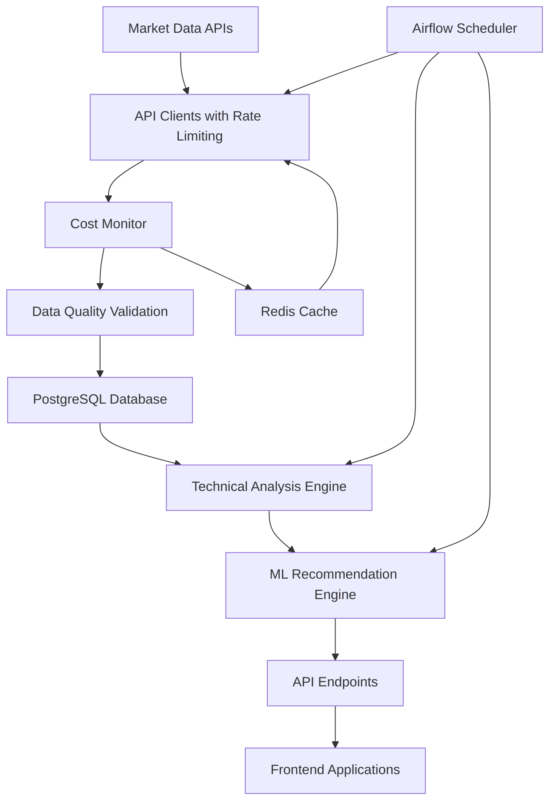

# Data Pipeline Activation Guide

## 🚀 Investment Analysis Data Pipeline

This guide provides comprehensive instructions for activating and managing the investment analysis data pipeline designed to process 6000+ stocks while maintaining costs under $50/month.

## 📋 Table of Contents

1. [Quick Start](#quick-start)
2. [Architecture Overview](#architecture-overview)
3. [Prerequisites](#prerequisites)
4. [Installation](#installation)
5. [Configuration](#configuration)
6. [Activation Process](#activation-process)
7. [Monitoring & Management](#monitoring--management)
8. [Troubleshooting](#troubleshooting)
9. [Cost Optimization](#cost-optimization)
10. [API Management](#api-management)

## ⚡ Quick Start

```bash
# 1. Clone and navigate to project
cd investment-analysis-platform

# 2. Copy environment template
cp .env.example .env

# 3. Edit configuration (add your API keys)
nano .env

# 4. Run the activation script
./start_data_pipeline.sh

# 5. Monitor the pipeline
python3 monitor_pipeline.py
```

## 🏗️ Architecture Overview

### Pipeline Components

1. **Apache Airflow**: Orchestrates ETL processes and scheduling
2. **PostgreSQL + TimescaleDB**: Primary database for time-series data
3. **Redis**: Caching and session management
4. **Cost Monitor**: Real-time API usage and budget tracking
5. **API Clients**: Multi-provider data ingestion (Finnhub, Alpha Vantage, Polygon)
6. **Stock Prioritization**: 5-tier system for intelligent resource allocation

### Data Flow Architecture



### Stock Prioritization Tiers

| Tier | Priority | Update Frequency | API Provider | Examples |
|------|----------|------------------|---------------|----------|
| 1 | Critical | Every hour | Finnhub | AAPL, MSFT, GOOGL |
| 2 | High | Every 4 hours | Alpha Vantage | S&P 500 mid-cap |
| 3 | Medium | Every 8 hours | Polygon | Active small-cap |
| 4 | Low | Daily | Yahoo Finance | Less active stocks |
| 5 | Minimal | Weekly | Cache only | Inactive/delisted |

## 📋 Prerequisites

### System Requirements

- **Operating System**: Linux (Ubuntu 20.04+), macOS, or Windows with WSL2
- **Memory**: 4GB+ RAM (8GB+ recommended for full 6000+ stock processing)
- **Storage**: 20GB+ free disk space
- **CPU**: 2+ cores (4+ recommended)
- **Network**: Stable internet connection

### Software Dependencies

- **Docker**: 20.10+ with Docker Compose
- **Python**: 3.11+ with pip
- **Git**: For repository management
- **curl**: For health checks

### API Accounts (Free Tiers)

1. **Finnhub** (Primary - Best free tier)
   - Sign up: https://finnhub.io/register
   - Free tier: 60 API calls/minute
   - Cost: $0/month

2. **Alpha Vantage** (Secondary)
   - Sign up: https://www.alphavantage.co/support/#api-key
   - Free tier: 25 API calls/day
   - Cost: $0/month

3. **Polygon.io** (Tertiary)
   - Sign up: https://polygon.io/dashboard/signup
   - Free tier: 5 API calls/minute
   - Cost: $0/month

4. **NewsAPI** (Optional for sentiment)
   - Sign up: https://newsapi.org/register
   - Free tier: 100 requests/day
   - Cost: $0/month

## 🛠️ Installation

### 1. Environment Setup

```bash
# Install Docker (Ubuntu/Debian)
curl -fsSL https://get.docker.com -o get-docker.sh
sudo sh get-docker.sh
sudo usermod -aG docker $USER

# Install docker-compose
sudo curl -L "https://github.com/docker/compose/releases/download/v2.21.0/docker-compose-$(uname -s)-$(uname -m)" -o /usr/local/bin/docker-compose
sudo chmod +x /usr/local/bin/docker-compose

# Install Python dependencies
pip3 install -r requirements.txt
```

### 2. Project Setup

```bash
# Clone the repository
git clone <repository-url>
cd investment-analysis-platform

# Create required directories
mkdir -p {data/cache,logs,models/trained}
mkdir -p data_pipelines/airflow/{logs,plugins}

# Set proper permissions
sudo chown -R $USER:$USER data_pipelines/
```

## ⚙️ Configuration

### Environment Variables

Copy `.env.example` to `.env` and configure:

```bash
# API Keys (Required for data ingestion)
ALPHA_VANTAGE_API_KEY=your_alpha_vantage_key_here
FINNHUB_API_KEY=your_finnhub_key_here
POLYGON_API_KEY=your_polygon_key_here
NEWS_API_KEY=your_news_api_key_here

# Database Configuration
DB_PASSWORD=your_secure_db_password
REDIS_PASSWORD=your_redis_password

# Cost Control
MONTHLY_BUDGET_LIMIT=50
DAILY_API_LIMIT_FINNHUB=1800
DAILY_API_LIMIT_ALPHA_VANTAGE=25
DAILY_API_LIMIT_POLYGON=150

# Airflow Configuration
AIRFLOW_ADMIN_PASSWORD=your_airflow_admin_password
FLOWER_PASSWORD=your_flower_password
```

### Database Configuration

The pipeline automatically creates and configures:

- **Primary Database**: `investment_db`
- **Airflow Database**: `airflow_db`
- **TimescaleDB Extensions**: For time-series optimization
- **Indexes**: Optimized for high-frequency queries

### API Rate Limiting

Built-in rate limiting configuration:

```python
API_LIMITS = {
    'finnhub': {'per_minute': 60, 'daily': float('inf')},
    'alpha_vantage': {'per_minute': 5, 'daily': 25},
    'polygon': {'per_minute': 5, 'daily': float('inf')},
    'news_api': {'per_minute': 100, 'daily': 100}
}
```

## 🚀 Activation Process

### Automated Activation

```bash
# Run the comprehensive activation script
./start_data_pipeline.sh
```

This script will:
1. ✅ Validate prerequisites
2. ✅ Check system resources
3. ✅ Start core services (PostgreSQL, Redis)
4. ✅ Initialize database schema
5. ✅ Start Airflow services
6. ✅ Run component tests
7. ✅ Validate pipeline health

### Manual Activation Steps

If you prefer manual activation:

```bash
# 1. Start core services
docker-compose up -d postgres redis

# 2. Initialize database
python3 activate_data_pipeline.py

# 3. Start Airflow
docker-compose -f docker-compose.airflow.yml up -d

# 4. Test components
python3 test_pipeline_components.py

# 5. Validate pipeline
python3 monitor_pipeline.py --once
```

### Post-Activation Configuration

1. **Access Airflow Web UI**: http://localhost:8080
   - Username: `admin`
   - Password: `secure_admin_password_789`

2. **Enable DAGs**:
   - `daily_market_analysis`: Main processing pipeline
   - `parallel_stock_processing`: High-performance parallel processing

3. **Configure API Keys**:
   - Ensure all API keys are properly set in `.env`
   - Test API connections in Airflow UI

## 📊 Monitoring & Management

### Real-Time Monitoring Dashboard

```bash
# Start live monitoring dashboard
python3 monitor_pipeline.py

# One-time status check
python3 monitor_pipeline.py --once
```

### Monitoring Features

- 🖥️ **System Resources**: CPU, Memory, Disk usage
- 🔧 **Service Status**: PostgreSQL, Redis, Airflow, Flower
- 🔄 **Pipeline Status**: Stock processing, batch progress
- 🔑 **API Usage**: Rate limits, daily quotas
- 💰 **Cost Tracking**: Budget usage, projections
- 🚨 **Active Alerts**: System and cost alerts

### Key Monitoring URLs

- **Airflow Web UI**: http://localhost:8080
- **Flower (Celery Monitor)**: http://localhost:5555
- **Redis Commander**: http://localhost:8081 (if enabled)

### Log Files

```bash
# Pipeline logs
tail -f logs/pipeline_activation.log
tail -f logs/pipeline_monitoring.log

# Airflow logs
tail -f data_pipelines/airflow/logs/scheduler/latest

# Docker logs
docker-compose logs -f airflow-scheduler
docker-compose logs -f airflow-worker-api
```

## 🔧 Troubleshooting

### Common Issues

#### 1. Port Conflicts

```bash
# Check port usage
netstat -tulpn | grep :8080

# Kill processes using required ports
sudo lsof -t -i:8080 | xargs kill -9
```

#### 2. Database Connection Issues

```bash
# Test PostgreSQL connection
docker exec -it investment_db_airflow psql -U postgres -d investment_db -c "SELECT 1;"

# Reset database
docker-compose down -v
docker-compose up -d postgres
python3 activate_data_pipeline.py
```

#### 3. Airflow Not Starting

```bash
# Check Airflow logs
docker-compose -f docker-compose.airflow.yml logs airflow-scheduler

# Reset Airflow
docker-compose -f docker-compose.airflow.yml down -v
docker-compose -f docker-compose.airflow.yml up -d
```

#### 4. API Rate Limiting Issues

```bash
# Check current API usage
python3 -c "
import redis
r = redis.Redis(host='localhost', port=6379, password='your_password', decode_responses=True)
print('Finnhub today:', r.get('api_usage:finnhub:daily:$(date +%Y%m%d)') or '0')
print('Alpha Vantage today:', r.get('api_usage:alpha_vantage:daily:$(date +%Y%m%d)') or '0')
"

# Reset rate limits (emergency only)
python3 -c "
import redis
from datetime import datetime
r = redis.Redis(host='localhost', port=6379, password='your_password')
today = datetime.now().strftime('%Y%m%d')
for provider in ['finnhub', 'alpha_vantage', 'polygon']:
    r.delete(f'api_usage:{provider}:daily:{today}')
print('Rate limits reset')
"
```

#### 5. Cost Monitoring Alerts

```bash
# Check current costs
python3 -c "
import redis, json
r = redis.Redis(host='localhost', port=6379, password='your_password', decode_responses=True)
config = r.get('cost_monitor_config')
if config:
    data = json.loads(config)
    print(f'Monthly budget: ${data[\"monthly_budget\"]}')
    print(f'Current cost: ${data[\"current_month_cost\"]}')
"

# Enable cost-saving mode manually
python3 -c "
import redis
r = redis.Redis(host='localhost', port=6379, password='your_password')
r.set('cost_saving_mode', '1', ex=86400)
print('Cost-saving mode enabled')
"
```

### Performance Optimization

#### Database Tuning

```sql
-- Connect to PostgreSQL and run these optimizations
\c investment_db

-- Analyze tables for better query planning
ANALYZE stocks;
ANALYZE price_history;
ANALYZE technical_indicators;

-- Check index usage
SELECT schemaname, tablename, indexname, idx_tup_read, idx_tup_fetch 
FROM pg_stat_user_indexes 
ORDER BY idx_tup_read DESC;

-- Monitor slow queries
SELECT query, mean_exec_time, calls 
FROM pg_stat_statements 
WHERE mean_exec_time > 100 
ORDER BY mean_exec_time DESC;
```

#### Redis Optimization

```bash
# Check Redis memory usage
docker exec investment_redis_airflow redis-cli --no-auth-warning AUTH your_password INFO memory

# Monitor Redis performance
docker exec investment_redis_airflow redis-cli --no-auth-warning AUTH your_password MONITOR
```

## 💰 Cost Optimization

### Automatic Cost Controls

The pipeline includes several automatic cost control mechanisms:

1. **Tiered Processing**: Higher priority stocks get more API calls
2. **Intelligent Caching**: Reduces redundant API calls
3. **Rate Limiting**: Prevents API overuse
4. **Fallback Providers**: Switches to free alternatives when rate limited
5. **Emergency Mode**: Activates when approaching budget limits

### Cost Monitoring Features

```bash
# View current cost status
python3 -c "
from backend.utils.enhanced_cost_monitor import get_cost_summary
import asyncio
import json
summary = asyncio.run(get_cost_summary())
print(json.dumps(summary, indent=2))
"
```

### Manual Cost Controls

```bash
# Enable aggressive cost-saving mode
python3 -c "
import redis
r = redis.Redis(host='localhost', port=6379, password='your_password')
r.set('cost_saving_mode', '1', ex=86400)
r.set('cache_ttl_multiplier', '5', ex=86400)  # 5x longer cache
print('Aggressive cost-saving enabled')
"

# Limit to critical stocks only
python3 -c "
import redis
r = redis.Redis(host='localhost', port=6379, password='your_password')
r.set('stock_filter', 'critical_only', ex=86400)
print('Processing limited to critical stocks')
"
```

### Budget Tracking

The system tracks costs across categories:

- **Compute**: $15 (Server costs)
- **Storage**: $10 (Database/storage)
- **Network**: $5 (CDN/bandwidth)
- **APIs**: $0 (Free tiers only)
- **Monitoring**: $5 (Monitoring tools)
- **Buffer**: $15 (Safety margin)

## 🔑 API Management

### API Key Configuration

1. **Finnhub** (Primary):
   ```bash
   export FINNHUB_API_KEY="your_finnhub_key_here"
   ```

2. **Alpha Vantage** (Secondary):
   ```bash
   export ALPHA_VANTAGE_API_KEY="your_alpha_vantage_key_here"
   ```

3. **Polygon.io** (Tertiary):
   ```bash
   export POLYGON_API_KEY="your_polygon_key_here"
   ```

### API Testing

```bash
# Test all API connections
python3 test_pipeline_components.py

# Test specific API
python3 -c "
from backend.data_ingestion.finnhub_client import FinnhubClient
import asyncio
async def test():
    client = FinnhubClient()
    async with client:
        data = await client.get_quote('AAPL')
        print('Finnhub test:', 'SUCCESS' if data else 'FAILED')
asyncio.run(test())
"
```

### API Usage Optimization

The pipeline uses several strategies to optimize API usage:

1. **Smart Batching**: Groups API calls efficiently
2. **Concurrent Requests**: Maximizes throughput within rate limits
3. **Circuit Breakers**: Prevents cascading failures
4. **Fallback Chains**: Switches providers when limits reached
5. **Cache-First**: Always checks cache before API calls

## 📈 Scaling & Performance

### Horizontal Scaling

The pipeline is designed to scale horizontally:

```bash
# Scale Airflow workers
docker-compose -f docker-compose.airflow.yml up -d --scale airflow-worker-api=3

# Scale processing tasks
# Edit parallel_stock_processing.py to adjust batch sizes and worker counts
```

### Performance Tuning

Key performance parameters in `docker-compose.airflow.yml`:

```yaml
# Increase worker concurrency
AIRFLOW__CELERY__WORKER_CONCURRENCY: 8

# Adjust parallelism
AIRFLOW__CORE__PARALLELISM: 64
AIRFLOW__CORE__DAG_CONCURRENCY: 32

# Tune database connections
AIRFLOW__CORE__SQL_ALCHEMY_POOL_SIZE: 20
```

### Resource Monitoring

```bash
# Monitor resource usage
htop
docker stats
df -h
```

## 🛡️ Security & Compliance

### Security Features

- **Environment-based secrets**: No hardcoded credentials
- **Network isolation**: Docker networks for service isolation
- **Rate limiting**: Prevents abuse and DDoS
- **Audit logging**: Comprehensive logging for compliance
- **Data encryption**: Sensitive data encrypted at rest

### Compliance Features

- **SEC Compliance**: 7-year audit log retention
- **GDPR Compliance**: Data anonymization and right-to-be-forgotten
- **SOX Compliance**: Financial data integrity controls

## 🔄 Maintenance & Updates

### Regular Maintenance

```bash
# Weekly maintenance script
#!/bin/bash

# Update Docker images
docker-compose pull
docker-compose -f docker-compose.airflow.yml pull

# Clean up old data
docker system prune -f

# Backup database
pg_dump investment_db > backups/investment_db_$(date +%Y%m%d).sql

# Rotate logs
find logs/ -name "*.log" -mtime +7 -delete

# Update API usage statistics
python3 -c "from backend.utils.cost_monitor import generate_monthly_report; generate_monthly_report()"
```

### System Updates

```bash
# Update Python dependencies
pip install -r requirements.txt --upgrade

# Update Docker containers
docker-compose down
docker-compose pull
docker-compose up -d
```

## 📞 Support & Troubleshooting

### Getting Help

1. **Documentation**: Check this guide and inline code documentation
2. **Logs**: Always check logs first (`logs/` directory)
3. **Monitoring**: Use the monitoring dashboard for real-time insights
4. **Testing**: Run component tests to isolate issues

### Emergency Procedures

#### Pipeline Stuck
```bash
# Stop all services
docker-compose down
docker-compose -f docker-compose.airflow.yml down

# Clean up
docker system prune -f

# Restart
./start_data_pipeline.sh
```

#### Cost Overrun
```bash
# Emergency cost control
python3 -c "
import redis
r = redis.Redis(host='localhost', port=6379, password='your_password')
r.set('emergency_mode', '1', ex=86400)
r.set('stock_filter', 'tier1_only', ex=86400)
print('Emergency mode activated')
"
```

#### Data Corruption
```bash
# Restore from backup
psql investment_db < backups/investment_db_latest.sql

# Rebuild indexes
psql investment_db -c "REINDEX DATABASE investment_db;"
```

---

## 📚 Additional Resources

- **Airflow Documentation**: https://airflow.apache.org/docs/
- **PostgreSQL TimescaleDB**: https://docs.timescale.com/
- **Redis Documentation**: https://redis.io/documentation
- **Docker Compose**: https://docs.docker.com/compose/

---

*This pipeline is designed to be cost-effective, scalable, and production-ready. For additional support or customizations, refer to the inline code documentation and monitoring tools.*