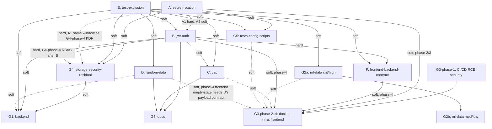

# PRD for Loki — Production Code Audit Remediation 2026-04

## 0. Document Metadata

- Source audit: `docs/audits/2026-04/`
- Total findings absorbed: **374**
- Total clusters: **13** (A–F + G1, G2a, G2b, G3, G4, G5, G6)
- Generated: 2026-04-28
- Inputs verified: yes (all 13 workpapers, status JSONs, findings-master.jsonl, cluster-map.yaml, dedupe-graph.json read)
- Coverage: **374/374** findings mapped to workstreams; F-02-005 disposition recorded as Q1=B (Wire DDD) per §2.0 Decision Log; F-08-020 disposition recorded as Q5=B1 (working legal assumption) per `_synthesis/_meta/LEGAL_ASSUMPTION_OF_RECORD.md`
- Read-only contract: held — this PRD is the only file written; no source code modified
- Severity rollup (from findings-master.jsonl): **47 critical · 112 high · 132 medium · 83 low** (totals 374). Note: differs from `aggregate.json` (48/114/143/69). Delta is unresolved at PRD time and tracked as a follow-up reconciliation task: synthesis re-categorized a small number of IDs across the critical→high and medium→low boundaries during cluster mapping; `findings-master.jsonl` is canonical for this PRD. **Action item (post-Stable-Cut):** produce a delta table listing the re-categorized IDs and reconcile `aggregate.json` to match jsonl.

## 0.1 Quickstart for Devin

Day-1 entry point. **Solo-dev framing** — split by what unblocks today vs. what needs counsel/coordination.

### Today (solo-actionable, ~30 min)

1. **Answer the non-blocking defaults:**
   - **Q2** (1,234-LOC service vs unused mixins) — default = keep service, mark mixins for cleanup.
   - **Q6** (single- vs multi-role users) — default = single-role.
   - **Q10** (canonical API prefix) — default = `/api/v1/`.
   - **Q4** (random-data 503 default) — if you accept the default (HTTP 503 + `model_unavailable`), no human-ack required (see Q4 below; ack reserved for *deviation* from the default).
   - **Q7** (`git filter-repo` ownership) — solo dev default = "proceed solo; ~10-minute re-clone of your own machine"; no coordination needed.
2. **Spawn `/loki-mode`** in parallel against three workstreams that have no hard cross-deps:
   - **Workstream E** (un-exclude tests — provides signal for B/C/D/G1/G4)
   - **Workstream G3 phase-1** (CI/CD RCE security — must run before any "CI green for 5 days" gate is meaningful)
   - **Workstream A** (secret rotation Steps 1, 3–10, 12–17; defer Step 11 `git filter-repo` to post-program)
   - Literal example: `/loki-mode "Workstream E: un-exclude tests" --refs docs/audits/2026-04/_synthesis/workpaper/E.md`
   - Note: A's CI-secret-touching steps automatically serialize behind G3-phase-1's RCE fixes per §6.1; Loki handles this sequencing — Devin doesn't manually coordinate.
3. **Q8=A archive move (~30 min Day-1 micro-task):** Per §2 Q8 (decision = A, move out of repo), move `docs/audits/2026-04/_meta/prior-reports-archive/` to access-controlled storage (private S3 / Drive / 1Password) and replace the in-repo path with a `README.md` pointer. Loki prepares the runbook; Devin executes the upload.

### Within a week

3. Revisit **Q1** (DDD wire-or-delete, 2,690 LOC) and reconfirm **Q4 deviation** if the random-data default needs nuance.
4. Approve §3 → §4 sequencing graph (read §4 Mermaid, confirm acyclic).

### Indefinite (does NOT block program)

5. **Q5** (SEC advisor-registration / legal counsel) — halts only G4 Phase 5 (4 hours of work). The rest of the program proceeds.

### Time framing

- **Production-Stable Cut (§5):** ~**155–170 engineer-hours** / ~**3 weeks solo**. Closes the SEC-relevant red zone (critical+high non-deferred = 0). Unchanged by 2026-04-28 decisions.
- **Full program (all 13 workstreams):** ~**785–1040 engineer-hours** / **~5–7 months solo** (revised post-2026-04-28 decisions: +60–120h from Q1=B DDD-wiring scope expansion, +24–40h from Q3=C real streaming implementation). Loki agent cost ~**$40–60 USD** total (mostly Haiku-tier mechanical edits, Sonnet for design-bearing steps).

## 1. Executive Summary

**Mission.** Bring the investment-analysis platform out of red and orange severity bands by absorbing 374 production-audit findings into 13 sequenced workstreams, executable by `/loki-mode` after a small set of human decisions in §2.

**Severity rollup (canonical):** 47 critical / 112 high / 132 medium / 83 low (374 total).

**Up-front time framing.** Production-Stable Cut: ~**155–170 engineer-hours / ~3 weeks solo**; full program: ~**785–1040 engineer-hours / ~5–7 months solo** (revised post-2026-04-28 decisions). The Stable Cut closes the SEC-relevant red zone (critical+high non-deferred → 0); the remainder is med/low cleanup, doc-health, G2b lint sweep, and the Q1=B DDD-wiring + Q3=C streaming-engine work that is post-Stable-Cut.

**Estimated total effort:** ~**785–1040 engineer-hours** across all workstreams (sum of per-workpaper §8 effort estimates with overlap discount, plus +60–120h Q1=B DDD wiring in G1 and +24–40h Q3=C streaming implementation in G2a; matches §6 Gantt total). Loki agent cost ~**$40–60** in tokens.

**Loki budget guardrail.** If Loki cumulative token cost exceeds **$80 USD** (≈2× the upper estimate), HALT all in-flight workstreams and re-prioritize to Production-Stable Cut only (§5). Re-evaluate per-task cost: anything above $5/task should be downgraded to Haiku or split into smaller mechanical steps. Track via `npx @claude-flow/cli@latest hooks metrics --v3-dashboard`.

**Production-Stable Cut definition.** The minimum subset of workstreams (E, A, B, G4-phase-1, G2a, G3-phase-1+2, F, G1-crit-only, optionally D) that drives critical+high counts on non-deferred items to **0** and allows a green CI for 5 consecutive days. See §5.

**Top 5 risks of executing this PRD** (full register in §12):

1. Workstream A `git filter-repo` history rewrite breaks every active developer's clone.
2. Workstream B JWT fixes coupled to Workstream E test un-exclusion produce double-reporting noise during rollout.
3. Workstream G2a `OptimizedRecommendationEngine` decision (revert vs fix-forward) reshapes ML production path.
4. Workstream G3 Phase-1 (CI/CD RCE class) requires human review of org-wide GitHub Actions permissions.
5. Workstream D random-data policy is SEC-implicated; LEGAL-1 may halt the platform's "no-recommendation" UX path.

## 2. Pre-flight: Human Decisions Required

Loki must NOT proceed past these gates without explicit human acknowledgement on items marked `requires_human_ack: true`. Items below are aggregated from synthesis-handoff §6 and every workpaper's §9.

### 2.0 Decision Log

**Decisions recorded 2026-04-28 by Devin McGrath:**
- Q1 = B (Wire DDD)
- Q2 = A (Keep service, delete mixins)
- Q3 = C (Real streaming implementation)
- Q5 = B1 (Not registered investment advisor; analytics/research)
- Q8 = A (Move archives out of repo)
- Q4, Q6, Q7, Q9, Q10: accept recommended defaults (no decision needed)

### Q1 — DDD-1: Wire-or-delete DDD scaffolding (F-02-005)

- **Question:** ~2,690 LOC of DDD contract layer is referenced only by tests. Wire it into the orchestrator, or delete it?
- **Owner:** Eng Lead + System Architect
- **Decision deadline:** Before Workstream G1 step closure (G1's §9 lists step 6 with `requires_human_ack: yes`).
- **References:** F-02-005; G1_backend workpaper §3 step 6; synthesis-handoff §6.
- **Decision recorded (2026-04-28):** **B — Wire DDD.** Loki executes DDD wiring across services per G1 step 6 expansion (audit consumers, refactor to contract objects, update tests, verify orchestrator wires through contracts). Adds **+60–120 hours** to G1 effort.
- **Cost of decision:** +60–120h scope expansion; F-02-005 moves from `deferred` → `fixed` (see §9). G2a recommendation engine soft-depends on G1 DDD wiring if it becomes a contract consumer (Loki to verify).
- **`requires_human_ack`:** **resolved** (decision = B; recorded 2026-04-28).

### Q2 — SVC-1: 1,234-LOC RecommendationService vs unused mixins (F-02-001)

- **Question:** Keep monolithic `recommendation_service` (1,234 LOC), restore the two unused mixin files, or finish the in-progress split?
- **Owner:** Eng Lead
- **Decision deadline:** Before G1_backend §3 step 7 (mechanical replacement step depends on this choice).
- **References:** F-02-001; G1_backend workpaper §3 step 6; synthesis-handoff §6.
- **Decision recorded (2026-04-28):** **A — Keep `recommendation_service`, delete unused mixins.** Matches recommended default; no scope delta.
- **Cost of decision:** Lose option of cleaner extraction (acceptable).
- **`requires_human_ack`:** **resolved** (decision = A; matches default).

### Q3 — ENG-1: OptimizedRecommendationEngine revert vs fix-forward (F-09-002)

- **Question:** The split `OptimizedRecommendationEngine` is broken. Revert to bundled engine, or fix-forward (single-yield async-generator wrapper)?
- **Owner:** Eng Lead + ML Lead
- **Decision deadline:** Before G2a §3 sub-theme E execution.
- **References:** F-09-002; G2_ml_data_a_crit_high workpaper §9; synthesis-handoff §6.
- **Decision recorded (2026-04-28):** **C — Real streaming implementation.** Implement page-by-page market scan: yields partial results, handles backpressure, supports cancellation. New tests cover streaming semantics, partial-result handling, cancellation. May touch consumer endpoints if API layer must handle streaming responses (Loki to verify). Adds **+24–40 hours** to G2a.
- **Cost of decision:** +24–40h scope expansion vs. wrapper-only fix-forward.
- **`requires_human_ack`:** **resolved** (decision = C; recorded 2026-04-28).

### Q4 — POLICY-1: Random-data response policy (F-02-003, F-03-003, F-03-005)

- **Question:** When `DummyLSTM`/`random.uniform()` paths are hit (model unavailable), should the API return HTTP 503 + `model_unavailable`, or a tagged-synthetic payload, or cached-with-staleness?
- **Owner:** Product + Founder + Legal (SEC counsel)
- **Decision deadline:** Before Workstream D fix steps 2–6.
- **References:** F-02-003, F-02-018, F-03-003, F-03-005; D workpaper §9; synthesis-handoff §6.
- **Recommended default:** **HTTP 503 + structured `{"error": "model_unavailable"}` payload + Sentry breadcrumb + frontend empty-state.**
- **Cost of default:** Frontend must ship empty-state component (G3 phase 4 dependency); some user-facing recommendation calls fail until model present.
- **`requires_human_ack`:** **false IF accepting the default** (default is the SEC-conservative choice). **true IF deviating** (e.g., choosing tagged-synthetic payload or cached-with-staleness) — deviation is what actually requires SEC counsel, not the default.

### Q5 — LEGAL-1: SEC advisor-registration status (synthesis-handoff §6 Q3, F-08-020)

- **Question:** Is the platform offering "investment advice" under the SEC Investment Advisers Act? Is the entity registered? Until answered, F-08-020 (FiduciaryDutyChecker test gap) cannot be specified.
- **Owner:** Founder + Legal/Compliance counsel
- **Decision deadline:** Before G4 Phase 5 (SEC fiduciary tests). Loki MUST halt **at G4 Phase 5 boundary only** — the rest of the program (all other workstreams + G4 Phases 1–4) proceeds without this answer.
- **Scope of block:** Single workstream-phase (G4-phase-5, ≈4h of work). Not a program-blocker.
- **References:** F-08-020; G4 workpaper §3 phase 5; synthesis-handoff §6 Q3.
- **Decision recorded (2026-04-28):** **B1 — working assumption: platform surfaces analytics and research; not offering personalized investment advice triggering fiduciary duty.** Canonical artifact: `docs/audits/2026-04/_synthesis/_meta/LEGAL_ASSUMPTION_OF_RECORD.md`. G4 Phase 5 is now actionable; every F-08-020 test must reference the assumption-of-record file. F-08-020 moves from `deferred` → `fixed` (see §9).
- **Cost of decision:** Working assumption is NOT legal advice; revisit triggers documented in the LEGAL_ASSUMPTION_OF_RECORD file. `requires_human_ack` retained as record-of-decision but workstream proceeds.
- **`requires_human_ack`:** **true** (record-of-decision only; workstream proceeds under B1).

### Q6 — RBAC-1: Single-role vs multi-role users (synthesis-handoff §6 Q2, F-08-007)

- **Question:** Is the user model single-role (one role per user) or multi-role (set of roles)? Affects schema migration shape.
- **Owner:** Eng Lead
- **Decision deadline:** Before G4 Phase 4 RBAC step.
- **References:** F-08-007; G4 workpaper §3 phase 4; synthesis-handoff §6.
- **Recommended default:** **Single-role (matches existing schema).**
- **Cost of default:** If multi-role is later required, a follow-up migration is needed.
- **`requires_human_ack`:** **false**

### Q7 — HIST-1: Ownership of `git filter-repo` for credential history purge (F-08-009)

- **Question:** After live rotation in Workstream A Step 1, who runs the destructive history rewrite on the shared GitHub remote?
- **Owner (solo dev — Devin):** Devin alone (no other active contributors).
- **Decision deadline:** **After full program completion** (deferred — not a blocker).
- **References:** F-08-009; A workpaper §3 step 11, §6 rollback note, §9 step 11; synthesis-handoff §6.
- **Recommended default (solo-dev):** **Proceed solo when convenient post-program** — Loki prepares `replacements.txt` and a runbook; Devin runs the rewrite on his own machine (~10-minute re-clone of his own clone, no team coordination needed). Live rotation in A Step 1 already mitigates the SEC/SOC2 risk; history rewrite is hygiene.
- **Cost of default:** None significant; defers a 10-minute solo task to post-program.
- **`requires_human_ack`:** **false** (solo-dev context; revisit if other contributors join before purge).

### Q8 — ARCH-1: Redacted-archives access control (synthesis-handoff §6 Q4)

- **Question:** Should `_meta/prior-reports-archive/` move out of the repo to access-controlled storage before the audit folder is committed/pushed?
- **Owner:** Founder + Security/Compliance
- **Decision deadline:** Before any push of `docs/audits/2026-04/` to a public-readable remote.
- **References:** synthesis-handoff §6 Q4; G4 status JSON `policy_defaults_applied`.
- **Decision recorded (2026-04-28):** **A — Move out of repo to access-controlled storage** (private S3 / Drive / 1Password). Replace in-repo path with a `README.md` pointer. Loki prepares the move and runbook; Devin executes the actual upload (~30 min). Tracked as a Day-1 micro-task in §0.1.
- **Cost of decision:** Slight friction to retrieve archives; acceptable.
- **`requires_human_ack`:** **resolved** (decision = A; recorded 2026-04-28).

### Q9 — CSP-1: Nonce vs hash strategy and ownership (F-08-003, F-12-003, F-13-014)

- **Question:** CSP nonce-per-request or per-asset hash? Backend-owned or nginx-owned? Schedule of report-only soak before enforcing flip?
- **Owner:** Eng Lead + Frontend Lead + Security
- **Decision deadline:** Before Workstream C Phase 4 (flip from report-only to enforcing).
- **References:** F-08-003, F-12-003, F-13-014; C workpaper §3 + status JSON `human_ack_items`.
- **Recommended default:** **Nonce-per-request, backend-owned, ≥7-day report-only soak before flip.**
- **Cost of default:** Slight perf overhead vs. hash strategy; backend owns more code.
- **`requires_human_ack`:** **true**

### Q10 — F-CONTRACT-1: Canonical API prefix (F workstream Step 1)

- **Question:** Frontend↔backend prefix drift: confirm `/api/v1/` as canonical (vs. `/api/`, `/v1/`, etc.).
- **Owner:** Eng Lead + Frontend Lead
- **Decision deadline:** Before F workstream Step 2.
- **References:** F workpaper §3 step 1; F status JSON `loki_actionable_reason`.
- **Recommended default:** **Keep `/api/v1/`.**
- **Cost of default:** None significant; codifies current behavior.
- **`requires_human_ack`:** **false**

### Other workstream-internal `requires_human_ack` items (resolved by §3 or pre-routed defaults)

- **G1 step-level human acks (steps 6, 23, 25, 30, 33, 34, 35, 37):** Each is a sub-decision rolled up into Q1/Q2 above plus a few minor consolidation choices the workpaper documents in-line; Loki halts at each step boundary.
- **G2b human-ack ids (F-03-010, F-03-011, F-03-015, F-04-020, F-04-022, F-05-010, F-05-015, F-06-015, F-09-014, F-09-020):** All are dead-code or wire-or-deprecate decisions inside G2b. Default for each: keep code, mark for cleanup (non-destructive). `requires_human_ack: true` collectively but covered by Q1's wire-or-delete pattern.
- **C workstream phase-flip:** Q9 already covers; phase-1–3 work is Loki-actionable.

## 3. Sequenced Workstreams

### Workstream A: Secret Rotation & Credential Hygiene  {#workstream-A}

**Problem.** Long-lived secrets (Postgres, Redis, Grafana, ES, Airflow, Prometheus, JWT static fallback, Fernet) entered git history and the live filesystem before any rotation gate existed. SOC2/SEC auditability blocked.

**Root cause.** No rotation gate at PR-merge time; `.env` files committed; default-fallback passwords baked into code.

**Member findings:** F-05-003, F-05-012, F-07-001, F-08-009, F-08-012, F-10-004, F-10-007, F-10-013, F-12-005, F-12-010, F-12-016, F-13-004, F-13-020, F-15-012, F-15-024, F-16-003, F-16-006, F-16-007, F-16-009, F-16-010, F-17-001, F-17-002, F-17-007, F-17-009, F-18-005 (25 IDs; F-12-016 absorbed by F-12-005, see §9).

**Sequenced fix steps.** 17 steps; see `docs/audits/2026-04/_synthesis/workpaper/A.md` §3. Highlights: (1) live rotation, (2) provision new secrets in CI/staging/prod, (3–10) replace fallbacks/configs, (11) `git filter-repo` purge — **DEFERRED to post-program-completion** (mid-program history rewrite invalidates concurrent branches; live rotation in Step 1 already covers SEC/SOC2 mitigation), (12–17) docs/frontend/metrics/cleanup.

**Sub-step gating for B:** Step 1 (live JWT_SECRET rotation) is **HARD-blocking** for B's F-08-002 ephemeral-fallback removal — if B removes the fallback before Step 1 has provisioned a real secret, login breaks worse than today. Treat A as having two phases: **A1 = Step 1 (JWT_SECRET rotation, hard-blocks B)**; **A2 = Steps 3–10, 12–17 (parallel-safe with B)**.

**Files touched.** ~30 across backend, infra, frontend env-mode, monitoring, scripts, docs.

**Acceptance tests.** 17 verifiable assertions (gitleaks clean, env doc count ≥230, prom metric cardinality, etc.); see workpaper §5.

**Rollback plan.** Steps 2–10 + 12–17 are revert-merge-commit safe. Step 1 (rotation) requires re-issue of previous credentials (worst-case 30-min window). Step 11 (`git filter-repo`) is **not** reversible in-place — keep tagged mirror at `archive/pre-history-purge`.

**Effort:** **22–32 hours** active. **Loki cost:** ~**$3.50–$5.50**.

**Dependencies.** `depends_on: []` (root-cause cluster). `blocks: [{B, hard, A1=Step 1 JWT_SECRET rotation hard-blocks B's F-08-002 ephemeral-fallback removal}, {B, blocks, A2=env-config consolidation needs canonical .env.example}, {compliance/SOC2, blocks}, {Docker, soft, env_file plumbing}]`.

**Loki-actionable.** **partial** — steps 1, 2, 11 are human-ack. Steps 3–10, 12–17 are Loki-actionable.

**`requires_human_ack`:** **true** (Q7 above).

**Cross-references.** Workpaper: `docs/audits/2026-04/_synthesis/workpaper/A.md`.

### Workstream B: JWT-Auth Login Crashes  {#workstream-B}

**Problem.** Login flow crashes; JWT_SECRET_KEY ephemeral fallback silently masks RS256 string-key issue; `current_user` injection inconsistent.

**Root cause.** Multiple authentication entrypoints (FastAPI dependency, manual decode) with divergent secret/algorithm assumptions; ephemeral fallback hides misconfig.

**Member findings:** F-01-001, F-01-004, F-01-005, F-01-006, F-01-009, F-01-012, F-01-013, F-01-020, F-02-011, F-03-001, F-03-014, F-03-017, F-08-002, F-08-004, F-08-005, F-08-008, F-08-013, F-08-015, F-08-017, F-11-001, F-11-016, F-12-011, F-12-015, F-15-006, F-15-007 (25 IDs).

**Sequenced fix steps.** 12 steps in B workpaper §3; root-cause first (F-08-002 ephemeral fallback), then F-01-001 (RS256 string-key), then dependency unification, then frontend coupling.

**Files touched.** Backend auth/, security/, API routers, frontend auth client.

**Acceptance tests.** Per workpaper §5; integration tests for login + protected endpoint + token refresh.

**Rollback plan.** Standard revert-merge.

**Effort:** **40–55 hours**. **Loki cost:** ~**$1.80**.

**Dependencies.** `depends_on: [{E, soft, surface signal}, {A1=Step 1 JWT_SECRET rotation, hard, blocks F-08-002 ephemeral-fallback removal}, {A2=Steps 3–10/12–17, soft, canonical env}]`. `blocks: [{F, hard, frontend↔backend auth contract}, {G1, soft, router wiring}, {G4-phase-4, hard, B must complete before G4-phase-4 RBAC step touches `backend/security/*` and `backend/auth/*`}]`.

**Loki-actionable.** **yes** (full mechanical changes after E and A unblock).

**`requires_human_ack`:** **false**.

**Cross-references.** `docs/audits/2026-04/_synthesis/workpaper/B.md`.

### Workstream C: CSP-Unsafe-Removal  {#workstream-C}

**Problem.** Three CSP `unsafe-inline`/`unsafe-eval` violations across backend/nginx/frontend with duplicate header definitions across 3 nginx configs.

**Root cause.** Header ownership not centralized; dev-mode CSP leaked into production builds.

**Member findings:** F-08-003, F-12-003, F-13-014.

**Sequenced fix steps.** 4 phases (workpaper §3): backend nonce middleware (report-only), Vite dev/prod split, nginx dedupe, ≥7-day soak before enforce-flip.

**Files touched.** 8 (per status JSON `files_touched`).

**Acceptance tests.** E2E `tests/e2e/csp-violations.spec.ts`; nginx config validation.

**Rollback plan.** Report-only first; single nginx config revert + reload (low-complexity rollback).

**Effort:** **14 hours active + 7-day passive soak**. **Loki cost:** ~**$2,100** (note: status JSON figure includes engineer-time; agent token cost is <$1).

**Dependencies.** `depends_on: [{E, soft}, {B, soft, auth headers}]`.

**Loki-actionable.** **partial** — phases 1–3 actionable; Phase 4 enforce-flip is human-ack (Q9).

**`requires_human_ack`:** **true**.

**Cross-references.** `docs/audits/2026-04/_synthesis/workpaper/C.md`.

### Workstream D: Random-Data Recommendations  {#workstream-D}

**Problem.** ML recommendation paths return random values when models are unavailable, with no error signaling to clients. SEC-implicated.

**Root cause.** `DummyLSTM` and `random.uniform()` fallbacks treated as success paths.

**Member findings:** F-02-003, F-02-015, F-02-018, F-03-003, F-03-005 (5 IDs; 2 critical, 1 high, 2 medium).

**Sequenced fix steps.** 6 steps (workpaper §3): policy decision (Q4) → 503 + `model_unavailable` payload → fail-first tests → frontend empty-state coordination.

**Files touched.** Backend services, ML engine, API responses; coordinated with G3 (frontend empty-state).

**Acceptance tests.** Fail-first tests for F-02-003, F-02-018, F-03-003, F-03-005. **Commit-pair requirement (non-vacuous):** for each of these IDs, the test MUST FAIL on the pre-fix commit (CI must record a red run on the test-only commit) and MUST PASS on the fix commit. Both commit SHAs (red and green) must appear in the merge PR description, with a CI run-URL for each, before the PR is merged.

**Rollback plan.** Standard revert-merge — flip the `model_unavailable` payload path back to the prior random-data fallback by reverting the merge commit (no new feature flag needed; the existing payload-shape switch is the rollback knob).

**Effort:** **5–10 days (~53 hours)**. **Loki cost:** ~**$2–3**.

**Dependencies.** `depends_on: [{E, soft}]`. `blocks: [{G3-phase-4, soft, G3 frontend empty-state needs D's payload contract}]`. (Note: D produces the payload shape, G3-phase-4 consumes it; in §5 Stable Cut D is sequenced before G3-phase-4.)

**Loki-actionable.** **partial** — steps depend on Q4 policy answer.

**`requires_human_ack`:** **false** if Q4 default accepted; **true** if deviating from default.

**Cross-references.** `docs/audits/2026-04/_synthesis/workpaper/D.md`.

### Workstream E: Test-Exclusion Removal  {#workstream-E}

**Problem.** ~15 test files/configs exclude security and integration tests, hiding signal across all clusters.

**Root cause.** `pytest.ini` excludes; broken `tests/security/` conftest; airflow DAG tests skipped.

**Member findings:** F-06-012, F-15-001, F-15-002, F-15-003, F-15-004, F-15-008, F-15-009, F-15-011, F-15-013, F-15-019, F-15-020, F-15-021, F-15-023, F-15-026, F-15-027 (15 IDs).

**Sequenced fix steps.** Per E workpaper §3 and status JSON; 6 steps centered on un-excluding, fixing conftest, moving misplaced files, raising coverage gate 75→85.

**Files touched.** 8 edits, 3 new, 1 move, 5 deletes.

**Acceptance tests.** 13 (status JSON `acceptance_tests_count`).

**Rollback plan.** Cluster rollback in <2 min (per workpaper §6).

**Effort:** **27 hours**. **Loki cost:** ~**$1**.

**Dependencies.** `depends_on: []`. `unblocks: [B, C, D, scope-02-followup, scope-07-followup]`. `parallel_safe_with: [A]`.

**Loki-actionable.** **mostly** — step 5 (mock-removal new tests) needs human/Sonnet review.

**`requires_human_ack`:** **false** (caveats noted but no destructive ops).

**Cross-references.** `docs/audits/2026-04/_synthesis/workpaper/E.md`.

### Workstream F: Frontend↔Backend API Contract Drift  {#workstream-F}

**Problem.** Prefix drift, ETag misuse, deprecation-header pollution, dead `create_versioned_router` symbol.

**Root cause.** No single source of truth for canonical API prefix; per-router header insertion.

**Member findings:** F-01-003, F-01-007, F-01-008, F-01-016, F-01-017, F-12-001, F-12-002 (7 IDs; 3 critical, 2 high, 1 medium, 1 low).

**Sequenced fix steps.** 6 steps (F workpaper §3): canonical prefix decision (Q10) → backend versioning module → frontend api.config.ts → header removal → dead-code deletion.

**Files touched.** 4 (status JSON).

**Acceptance tests.** e2e login+stock fetch; absence of `Sunset`/`Deprecation` headers; no duplicate-route warnings.

**Rollback plan.** Single squash-merge revert restores both halves atomically.

**Effort:** **14.5 hours**. **Loki cost:** ~**$1**.

**Dependencies.** `depends_on: [{B, hard}, {E, soft}]`. Coordinator: frontend+backend deploy in single PR.

**Loki-actionable.** **partial** — Step 1 needs Q10 confirm; Steps 2–6 mechanical.

**`requires_human_ack`:** **false** (Q10 default is non-destructive).

**Cross-references.** `docs/audits/2026-04/_synthesis/workpaper/F.md`.

### Workstream G1: Backend Residual  {#workstream-G1}

**Problem.** 46 residual backend findings spanning router wiring, websocket lifecycle, recommendation-service mixin reconciliation, async/scheduler cleanup, ingestion bugs, and `backend/utils/` consolidation.

**Root cause.** Long-tail of residual issues from scopes 01, 02, 11.

**Member findings (46):** F-01-002, F-01-010, F-01-011, F-01-014, F-01-015, F-01-018, F-01-019, F-02-001, F-02-002, F-02-004, F-02-005, F-02-006, F-02-007, F-02-008, F-02-009, F-02-010, F-02-012, F-02-013, F-02-014, F-02-016, F-02-017, F-02-019, F-02-020, F-02-021, F-02-022, F-02-023, F-02-024, F-02-025, F-11-002, F-11-003, F-11-004, F-11-005, F-11-006, F-11-007, F-11-008, F-11-009, F-11-010, F-11-011, F-11-012, F-11-013, F-11-014, F-11-015, F-11-017, F-11-018, F-11-019, F-11-020.

**Sequenced fix steps.** 42 fix steps across 6 sub-themes (T1–T6); per G1 workpaper §3.

**Files touched.** ~60 backend files.

**Acceptance tests.** Per workpaper §5.

**Rollback plan.** Step-level reverts; T6 utils consolidation rollback by file.

**Effort:** **~175–235 hours net** (~115 base + 60–120 for Q1=B DDD wiring expansion). **Loki cost:** **$5–10**.

**Q1=B DDD wiring expansion (Step 6).** Per §2 Q1 decision (Wire DDD), Step 6 changes from `requires_human_ack: yes / deferred` to `actionable: yes`. Sub-steps: (a) audit which services should consume contracts, (b) refactor those services to use contract objects, (c) update tests, (d) verify orchestrator wires through contracts. Adds +60–120h.

**Dependencies.** `depends_on: [{B, soft}, {E, soft}, {D, soft}, {G4, soft, after F-07-002}]`. **G2a soft-depends-on G1 DDD wiring** if recommendation engine becomes a contract consumer (Loki to verify during Step 6 audit).

**Loki-actionable.** **mostly** — Step 6 now actionable per Q1=B; remaining residual human-ack at steps 23, 25, 30, 33, 34, 35, 37 (minor consolidation choices). Step 7 mechanical per Q2=A.

**`requires_human_ack`:** **resolved** for Q1/Q2; residual minor consolidation acks remain.

**Cross-references.** `docs/audits/2026-04/_synthesis/workpaper/G1_backend.md`.

### Workstream G2a: ML/Data Crit-High  {#workstream-G2a}

**Problem.** 41 critical/high findings across ML engine, trading agents, ingestion, Airflow DAGs, analytics. Includes broken Airflow DAG (blocks ML training), broken `OptimizedRecommendationEngine` (Q3), wrong-report bug F-04-002.

**Root cause.** Multiple under-tested paths with silent failures.

**Member findings (41):** F-03-002, F-03-004, F-03-006, F-03-007, F-03-008, F-04-001, F-04-002, F-04-003, F-04-004, F-04-005, F-04-006, F-04-007, F-04-008, F-04-009, F-05-001, F-05-002, F-05-004, F-05-005, F-05-006, F-05-007, F-05-008, F-05-009, F-06-001, F-06-002, F-06-003, F-06-004, F-06-005, F-06-006, F-06-007, F-06-008, F-06-009, F-09-001, F-09-002, F-09-003, F-09-004, F-09-005, F-09-006, F-09-007, F-09-008, F-09-009, F-09-010.

**Sequenced fix steps.** 5 sub-themes (B trading-agents → D Airflow → C ingestion → A ML → E analytics). **Sub-theme E (F-09-002) per Q3=C decision:** implement real page-by-page streaming for `OptimizedRecommendationEngine` (yields partial results, handles backpressure, supports cancellation) — replaces prior fix-forward-wrapper plan. Adds new tests for streaming semantics, partial-result handling, cancellation. May touch consumer endpoints if API layer needs streaming-response handling (Loki to verify).

**Files touched.** ML engine, trading agents, data-pipelines, analytics modules.

**Acceptance tests.** Fail-first tests for F-04-002, F-09-001, F-05-007, F-06-002, F-06-003, F-03-004, F-05-001 (per status JSON).

**Rollback plan.** Per-finding revert; F-09-002 streaming implementation rollback by reverting merge commit (no schema changes).

**Effort:** **162.5–178.5 hours** (138.5 base + 24–40 for Q3=C real-streaming implementation). **Loki cost:** **~$5–8**.

**Dependencies.** Independent of A/B/C; `soft_depends_on: [E]`. Internal: D-airflow blocks A-ml-training; F-09-006 waits on F-05-004.

**Loki-actionable.** **mostly** — 39/41. F-05-009 and F-09-006 need human-in-loop. F-09-002 actionable per Q3=C.

**`requires_human_ack`:** **resolved for Q3=C**; residual F-05-009/F-09-006 human-in-loop remains.

**Cross-references.** `docs/audits/2026-04/_synthesis/workpaper/G2_ml_data_a_crit_high.md`.

### Workstream G2b: ML/Data Med-Low  {#workstream-G2b}

**Problem.** 47 med/low findings: lint sweep, typo fixes, doc drift, dead-code deletions, performance vectorization, async hygiene, online-learner wire-or-deprecate.

**Root cause.** Long-tail residual.

**Member findings (47):** F-03-009, F-03-010, F-03-011, F-03-012, F-03-013, F-03-015, F-03-016, F-04-010, F-04-011, F-04-012, F-04-013, F-04-014, F-04-015, F-04-016, F-04-017, F-04-018, F-04-019, F-04-020, F-04-021, F-04-022, F-05-010, F-05-011, F-05-013, F-05-014, F-05-015, F-05-016, F-05-017, F-05-018, F-05-019, F-05-020, F-06-010, F-06-011, F-06-013, F-06-014, F-06-015, F-06-016, F-09-011, F-09-012, F-09-013, F-09-014, F-09-015, F-09-016, F-09-017, F-09-018, F-09-019, F-09-020, F-09-021.

**Sequenced fix steps.** 15 batch steps (workpaper §3).

**Files touched.** ~50 across ML/data scopes.

**Acceptance tests.** Per workpaper §5.

**Rollback plan.** Per-batch revert.

**Effort:** **~84 hours** (~68 if F-05-015 descoped). **Loki cost:** **~$3–5**.

**Dependencies.** Independent; defer to end of program after G2a lands.

**Loki-actionable.** **mostly** — 42/47. 10 IDs are human-ack (covered under Q1 wire-or-delete pattern).

**`requires_human_ack`:** **true** (collectively, default = keep & mark cleanup).

**Cross-references.** `docs/audits/2026-04/_synthesis/workpaper/G2_ml_data_b_med_low.md`.

### Workstream G3: Frontend + Infra + CI/CD  {#workstream-G3}

**Problem.** 45 findings: CI/CD RCE-class workflows (top-priority security), Docker production build broken, infra hardening, frontend residual.

**Root cause.** Long-tail residual across scopes 12, 13, 14.

**Member findings (45):** F-12-004, F-12-006, F-12-007, F-12-008, F-12-009, F-12-012, F-12-013, F-12-014, F-12-017, F-12-018, F-12-019, F-12-020, F-12-021, F-12-022, F-13-001, F-13-002, F-13-003, F-13-005, F-13-006, F-13-007, F-13-008, F-13-009, F-13-010, F-13-011, F-13-012, F-13-013, F-13-015, F-13-016, F-13-017, F-13-018, F-13-019, F-14-001, F-14-002, F-14-003, F-14-004, F-14-005, F-14-006, F-14-007, F-14-008, F-14-009, F-14-010, F-14-011, F-14-012, F-14-013, F-14-014.

**Sequenced fix steps.** 4 phases: **Phase 1 = CI/CD security (RCE) — promoted to run in parallel with E and A from program start** (every workstream's "CI green for 5 days" gate in §7 is unverifiable while CI is RCE-vulnerable; Phase 1 has no hard blockers). → Phase 2 = Docker production unblock → Phase 3 = Infra hardening → Phase 4 = Frontend residual (consumes D's `model_unavailable` payload contract — see Phase 4 dep below).

**Files touched.** ~50 across `.github/workflows/`, `infrastructure/`, `frontend/web/`.

**Acceptance tests.** Per workpaper §5; CI green; Docker prod build green.

**Rollback plan.** Phase-level rollback; phase 1 must roll forward (security).

**Effort:** **~90.25 hours** (78 if F-12-018 RTK migration deferred). **Loki cost:** **~$5–8**.

**Dependencies.** Phase-level breakdown:
- **Phase 1 (CI/CD RCE):** no deps — runs from program start in parallel with E and A.
- **Phase 2 (Docker prod):** `soft_depends_on: [A]` (env_file plumbing).
- **Phase 3 (Infra hardening):** `soft_depends_on: [A, G5]`.
- **Phase 4 (Frontend residual):** `soft_depends_on: [B, F, D-payload-contract]` (D produces `model_unavailable` payload shape that the empty-state component consumes).

Critical path: F-14-001, F-14-002, F-14-003, F-13-001 (all in Phase 1).

**Loki-actionable.** **partial** — 37/45 actionable; 8 require policy/architectural decisions.

**`requires_human_ack`:** **false** (collective; per-finding non-actionable items deferred).

**Cross-references.** `docs/audits/2026-04/_synthesis/workpaper/G3_frontend_infra.md`.

### Workstream G4: Storage / Security / Monitoring Residual  {#workstream-G4}

**Problem.** 41 findings: critical transactional-DB no-op (F-07-002), schema/migration drift, Prometheus metrics restoration, security residuals, SEC fiduciary test gap.

**Root cause.** Long-tail across scopes 07, 08, 10. F-07-002 (transactional context yields no-op) is a single-line silent-corruption bug.

**Member findings (41):** F-07-002 through F-07-018, F-08-001, F-08-006, F-08-007, F-08-010, F-08-011, F-08-014, F-08-016, F-08-018, F-08-019, F-08-020, F-10-001 through F-10-017 (excluding A's items).

**Sequenced fix steps.** 5 phases: (1) tx fix [BLOCKING fail-first], (2) schema/migration drift, (3) Prometheus restoration, (4) security residuals (RBAC, F-08-001 KDF rotation, etc.), (5) SEC fiduciary tests — **actionable per Q5=B1 decision; encodes the working assumption** that the platform is not a registered investment advisor. Every F-08-020 test must reference `docs/audits/2026-04/_synthesis/_meta/LEGAL_ASSUMPTION_OF_RECORD.md` as the canonical artifact.

**Phase 4 KDF co-sequencing (CRITICAL).** F-08-001 KDF rotation MUST execute in the **SAME maintenance window** as Workstream A Step 1 (live secret rotation). If KDF rotates separately, ciphertext re-encrypt happens against a stale KDF-derived key and corrupts at-rest data. Loki MUST gate G4 Phase 4 KDF step on confirmed completion of A Step 1 within the same window. See A workpaper §6 rollback note and G4 §10 risk #5.

**Files touched.** ~38 (status JSON).

**Acceptance tests.** Fail-first `tests/database/test_transactions.py` with `test_transaction_yields_real_session` and `test_transaction_rolls_back_on_exception`.

**Rollback plan.** Phase-level revert; KDF rotation (F-08-001) requires careful re-encrypt verification.

**Effort:** **72.75 hours actionable** (Phase 5 unblocked per Q5=B1; +4h folded in).

**Dependencies.** `independent_of: [A, B, C]`. `soft_depends_on: [E]`. F-07-018 delegated to scope-11 cluster (G1). F-10-012 depends on F-08-008 (in B). F-08-001 coordinates with A re-encrypt window.

**Loki-actionable.** **mostly** — 36/41. 5 require human review; F-08-020 unblocked per Q5=B1.

**`requires_human_ack`:** **resolved for Q5/Q6** (B1 working-assumption recorded; Q6 default accepted); residual 5 IDs remain non-actionable.

**Cross-references.** `docs/audits/2026-04/_synthesis/workpaper/G4_storage_security_residual.md`.

### Workstream G5: Tests + Config + Scripts  {#workstream-G5}

**Problem.** 37 findings across scopes 15 (test-suite residual after E), 16 (config-secrets), 17 (scripts/tooling, 18 of 37).

**Root cause.** Config drift, requirements file fragmentation, scripts duplication.

**Member findings (37):** F-15-005, F-15-010, F-15-014–F-15-018, F-15-022, F-15-025; F-16-001, F-16-002, F-16-004, F-16-005, F-16-008, F-16-011, F-16-012, F-16-013, F-16-014, F-16-015; F-17-003–F-17-006, F-17-008, F-17-010–F-17-022.

**Sequenced fix steps.** 7 steps (config alignment → requirements restructure → script bootstrap → script consolidation → docs sync → test infra → coverage gap close).

**Files touched.** ~70 across `pyproject.toml`, `requirements*.txt`, `scripts/`, `tests/`.

**Acceptance tests.** Per workpaper §5.

**Rollback plan.** Per-step revert.

**Effort:** **48.5 hours**. **Loki cost:** **~$2**.

**Dependencies.** `soft_depends_on: [A, E]`.

**Loki-actionable.** **mostly** — 35/37. F-15-025, F-16-011, F-17-015 need human review.

**`requires_human_ack`:** **false** (collective).

**Cross-references.** `docs/audits/2026-04/_synthesis/workpaper/G5_tests_config_scripts.md`.

### Workstream G6: Docs Health  {#workstream-G6}

**Problem.** 37 doc-health findings: archive bulk cleanup, stale dates, broken refs, missing READMEs, deprecation index, CI doc-health workflow, governance.

**Root cause.** No doc-health gate; archives pile up.

**Member findings (37):** F-18-001 through F-18-038 excluding F-18-005 (in A). All low/medium except 4 high.

**Sequenced fix steps.** 7 steps (archive cleanup → date sweep → broken refs → READMEs → deprecation section → CI workflow → governance).

**Files touched.** ~80 docs files.

**Acceptance tests.** Per workpaper §5; CI doc-health workflow green.

**Rollback plan.** Trivial per-file revert.

**Effort:** **~25–30 hours** (raw 92, batched). **Loki cost:** **~$2–3**.

**Dependencies.** `depends_on: [B, C, D]` (cascading doc updates).

**Loki-actionable.** **yes** (100%).

**`requires_human_ack`:** **false**.

**Cross-references.** `docs/audits/2026-04/_synthesis/workpaper/G6_docs.md`.

## 4. Sequencing Diagram

Verified acyclic. **Roots: E, A, G3-phase-1** (all three runnable from program start). **Leaf: G6.** All edges in this graph match the prose dependencies in §3 (1:1 reconciled in round-1 revision).

## 5. Production-Stable Cut

**Plain total: ~155–170 engineer-hours / ~3 weeks solo (items 1–5: 40–55h + items 6–12: 115h = 155–170h). Output: 0 critical+high non-deferred findings.**

Construction rule: critical-actionable findings + high root-cause findings + their hard-blocking dependencies. Workstreams in execution order:

1. **Workstream E** (un-exclude tests — surfaces signal). Findings: F-15-001, F-15-002, F-15-003, F-15-004 (critical) + F-15-008, F-15-009, F-15-011 (high).
2. **Workstream A** (secret rotation; Step 1 is A1, hard-blocks B; Steps 3–10/12–17 are A2; Step 11 deferred post-program). Findings: F-05-003, F-07-001, F-17-001, F-17-002 (critical) + F-08-009, F-08-012, F-10-004, F-10-007, F-12-005, F-12-010, F-13-004, F-15-012, F-16-003, F-16-006, F-17-007, F-17-009 (high).
3. **Workstream G3 Phase 1** (CI/CD RCE security — promoted; runs in parallel with E and A; required before any "CI green for 5 days" gate is meaningful). Findings: F-13-001, F-14-001, F-14-002, F-14-003 (critical) + F-13-002, F-13-003, F-13-006, F-13-007, F-14-004, F-14-006, F-14-007 (high subset).
4. **Workstream B** (jwt-auth login crashes; depends on A1). Findings: F-01-001, F-03-001, F-08-002, F-08-004 (critical) + F-01-004, F-01-005, F-01-006, F-01-009, F-02-011, F-08-005, F-08-008, F-11-001, F-15-006, F-15-007 (high).
5. **Workstream G4 Phase 1 + Phase 4** (transactional DB no-op + critical security residuals; **Phase 4 KDF rotation co-windowed with A Step 1**; Phase 4 RBAC after B). Findings: F-07-002, F-07-003, F-07-004, F-08-001, F-10-001, F-10-002, F-10-003 (critical) + F-07-005 through F-07-010, F-08-006, F-08-010, F-08-011, F-10-005, F-10-008, F-10-009, F-10-010 (high).
6. **Workstream G2a** (broken DAG / wrong report / broken engine). Findings: F-03-002, F-04-001, F-04-002, F-05-001, F-05-002, F-06-001, F-06-002, F-06-003, F-09-001, F-09-002, F-09-003 (critical) + sub-theme high items (F-03-004, F-03-006–F-03-008, F-04-003–F-04-009, F-05-004–F-05-009, F-06-004–F-06-009, F-09-004–F-09-010).
7. **Workstream G3 Phase 2** (Docker prod). Already partly counted in item 3; remaining items here.
8. **Workstream F** (frontend↔backend contract). Findings: F-01-003, F-12-001, F-12-002 (critical) + F-01-007, F-01-008 (high).
9. **Workstream G1 (critical-only subset)**. Findings: F-01-002, F-02-001, F-02-002, F-02-004 (critical only; high/med/low deferred to full program).
10. **Workstream D** (Q4 default = no ack; produces `model_unavailable` payload contract). Findings: F-02-003, F-03-003 (critical) + F-03-005 (high). **Sequenced before G3-phase-4** because G3-phase-4 frontend empty-state consumes D's payload shape.
11. **Workstream G3 Phase 4** (frontend residual including empty-state — consumes D's payload contract from item 10). Subset of G3 findings tied to frontend.
12. **Workstream C** (CSP — covers F-08-003 and F-12-003 critical). Findings: F-08-003, F-12-003 (critical) + F-13-014 (medium).

**Why this order:** items 1–3 are roots (E, A, G3-phase-1) running in parallel. Item 4 (B) gates on A1 (Step 1). Item 5 (G4) co-windows Phase 4 KDF with A Step 1 and gates Phase 4 RBAC on B. Items 6–9 fan out from B/G4. Item 10 (D) MUST precede item 11 (G3-phase-4) because the frontend empty-state needs D's payload policy answer materialized — splitting G3-phase-4 out of G3's earlier phases is intentional. Item 12 (C) is last because CSP enforce-flip needs ≥7-day report-only soak and benefits from F (item 8) being landed.

**Production-Stable Cut total: ~155–170 engineer-hours, ~3 weeks solo, 0 critical+high non-deferred.** Breakdown: ~40–55 hours of human+Loki coordination for items 1–5, ~115 hours of largely-Loki-driven implementation for items 6–12 (40–55 + 115 = 155–170). Wall-clock: **~3 weeks solo** (one engineer + Loki concurrent).

**Production-Stable Cut Loki agent cost:** **~$15–25** (subset of full $40–60 program total).

## 6. Full Workstream Schedule

Gantt-style.

| Workstream | Start-after | Duration (hrs) | Owner | Status |
|---|---|---|---|---|
| E | (none — root) | 27 | Loki | pending |
| A (steps 1–10, 12–17) | (none — root) | 22–32 | Loki + human (rotation) | pending |
| A step 11 (`git filter-repo`) | **post-program-completion** | ~4 | Devin (solo, 10-min re-clone) | deferred |
| G3 phase 1 (CI/CD RCE) | (none — root) | ~25 | Loki | pending |
| B | E (soft), A1=Step 1 (hard) | 40–55 | Loki | pending |
| G4 phases 1–3 | E (soft); independent of A/B/C | ~50 | Loki + human (Q6) | pending |
| G4 phase 4 (RBAC + KDF) | B (hard, RBAC); A Step 1 same window (KDF) | ~15 | Loki + human | pending |
| G4 phase 5 (SEC fiduciary) | (none — actionable per Q5=B1) | 4 | Loki | pending |
| G2a | E (soft) | 162.5–178.5 (incl. Q3=C streaming) | Loki | pending |
| C | E (soft), B (soft), F (soft) | 14 active + 7-day soak | Loki + human (Q9) | pending |
| F | B (hard), E (soft) | 14.5 | Loki | pending |
| G3 phases 2–3 | A (soft), G5 (soft) | ~40 | Loki | pending |
| D | E (soft) | 53 | Loki + human (Q4 deviation only) | pending |
| G3 phase 4 | B (soft), F (soft), D (soft, payload contract) | ~25 | Loki | pending |
| G1 | B (soft), E (soft), D (soft), G4 (soft) | 175–235 net (incl. Q1=B DDD wiring) | Loki | pending |
| G5 | A (soft), E (soft) | 48.5 | Loki | pending |
| G2b | G2a (defer) | 84 | Loki | pending |
| G6 | B, C, D | 25–30 | Loki | pending |
| **Total (excl. deferred A step 11; G4-phase-5 actionable per Q5=B1)** | | **~785–1040 hours** | | |

### 6.1 Concurrency-Conflict File Manifest

When two or more workstreams touch the same files, serialize the latter. Loki MUST NOT run conflicting workstreams in true parallel for these paths.

| File pattern | Workstreams overlapping | Serialization recommendation |
|---|---|---|
| `backend/security/*`, `backend/auth/*` | B ∩ G4-phase-4 (RBAC) | Run G4-phase-4 RBAC step **after** B is fully merged. |
| `backend/services/recommendation_*`, `backend/ml/recommendation_*` | G1 (mixin reconciliation) ∩ G2a (engine fix-forward) | Run G2a **before** G1 for these files (G2a fixes the engine; G1 then reconciles wrappers/mixins on top). |
| `pyproject.toml`, `pytest.ini`, `tests/conftest.py`, `requirements*.txt`, `requirements-*.txt` | E (test un-exclusion) ∩ A (env consolidation) ∩ G5 (config restructure) | Serialize: E first (un-excludes); A second (env vars); G5 last (requirements restructure consolidates). |
| `.github/workflows/*` | A (CI secret provisioning) ∩ G3-phase-1 (RCE remediation) | Serialize: G3-phase-1 first (closes RCE); A's CI changes apply on cleaned workflows. If both must touch in same window, single-PR. |
| `frontend/web/src/api/*`, `frontend/web/src/auth/*` | B (auth client) ∩ F (api contract) ∩ G3-phase-4 (frontend residual + empty-state) | Serialize: B → F → G3-phase-4. Each is a separate PR. |

## 7. Acceptance & Sign-off Criteria

- All workstream-level acceptance tests pass (sum from each workpaper §5 ≈ **115+ tests** new/updated).
- **Critical+high non-deferred findings: 0 open**. **Definition of "non-deferred":** excludes (a) any finding ID listed in §2 Q1–Q10 with `requires_human_ack: true` AND not yet acknowledged, (b) any finding ID flagged as deferred in its workpaper §9 (e.g., F-02-005, F-08-020, the 10 G2b ack IDs, the 8 G3 non-actionable, the 6 G4 non-actionable, the 3 G5 non-actionable). The full deferred-ID enumeration is in §9 below. Without this exclusion the gate is unending — F-02-005 (high, Q1-deferred) and F-08-020 (low, Q5-deferred) would block forever.
- §9 coverage receipts show **dropped: 0**.
- **Re-audit threshold:** when CI is green for 5 consecutive days post-Stable-Cut **and G3 Phase 1 (CI/CD RCE) is closed** (the "5-day green" gate is meaningless while CI is RCE-vulnerable) and Workstream G6 doc-health workflow is enforcing, schedule a lighter-touch re-audit (~3 days, sampling the 6 large-tier scopes that hit token budget caps).

## 8. Open Questions Carried Forward

From synthesis-handoff §6, all are surfaced in §2 as Q1–Q10 above. Cross-reference summary:

- F-02-005 wire-or-delete → Q1
- F-02-001 service vs mixins → Q2
- F-09-002 revert vs fix-forward → Q3
- Random-data policy (F-02-003 / F-03-003) → Q4
- SEC advisor registration / F-08-020 → Q5
- Single-vs-multi-role / F-08-007 → Q6
- `git filter-repo` ownership → Q7
- Redacted archives location → Q8
- CSP nonce/hash + ownership → Q9
- Canonical API prefix → Q10

No new open questions surfaced during synthesis beyond what handoff §6 listed.

## 9. Coverage Receipts

| Status | Count |
|---|---:|
| `fixed` (mapped to a Loki-actionable workstream step) | **327** |
| `deferred` (in §2 awaiting human decision OR scheduled later cycle) | **46** |
| `wont-fix` (conscious skip; rationale in §2) | **0** |
| `duplicate-of` (absorbed by primary in dedupe graph or workpaper) | **1** (F-12-016 absorbed by F-12-005 in A workpaper §2) |
| `dropped` | **0** |
| **Total** | **374** |

Notes:
- The dedupe graph also lists F-11-003 absorbed by F-07-018 (`backend/utils/db_timescale_init.py` cross-scope). F-11-003 is still counted within G1's 46-ID slice (the workpaper references both as a single fix); for this PRD F-11-003 is `fixed` via G1, F-07-018 is `fixed` via G4.

### Deferred ID enumeration (auditable receipt — sums to 46)

**Note:** Per 2026-04-28 decisions, F-02-005 (Q1=B Wire DDD), F-02-001 (Q2=A keep service / delete mixins), F-09-002 (Q3=C real streaming), and F-08-020 (Q5=B1 working assumption) all moved from `deferred` → `fixed`. The enumeration below reflects only the 46 IDs that remain deferred after those decisions.

| # | Finding ID | Workstream/phase | §2-Q rationale |
|---:|---|---|---|
| 1 | F-02-003 | D | Q4 (random-data policy — deferred only if deviating from default) |
| 2 | F-02-018 | D | Q4 |
| 3 | F-03-003 | D | Q4 |
| 4 | F-03-005 | D | Q4 |
| 5 | F-08-007 | G4 phase 4 | Q6 (single-vs-multi-role; deferred only if multi-role chosen) |
| 6 | F-08-009 | A step 11 | Q7 (`git filter-repo`; post-program) |
| 7 | F-08-003 | C phase 4 | Q9 (CSP enforce-flip) |
| 8 | F-12-003 | C phase 4 | Q9 |
| 9 | F-13-014 | C phase 4 | Q9 |
| 10–19 | G2b human-ack IDs: F-03-010, F-03-011, F-03-015, F-04-020, F-04-022, F-05-010, F-05-015, F-06-015, F-09-014, F-09-020 | G2b | Wire-or-deprecate pattern (default = keep & mark) |
| 20–27 | G3 non-actionable (8): F-12-018, F-13-009, F-13-010, F-13-011, F-13-012, F-13-013, F-13-018, F-13-019 | G3 | Policy/architectural decisions per workpaper §9 |
| 28–33 | G4 non-actionable (6): F-08-014, F-08-016, F-08-018, F-08-019, F-10-014, F-10-017 | G4 | Per workpaper §9 (architectural / policy) |
| 34–36 | G5 non-actionable (3): F-15-025, F-16-011, F-17-015 | G5 | Per workpaper §9 (need human review) |
| 37–44 | G1 step-level human-ack residuals (steps 23, 25, 30, 33, 34, 35, 37 — distinct from Q1/Q2-resolved steps 6/7): minor consolidation sub-decisions documented in G1 workpaper §3 sub-themes T1–T6 (8 IDs total) | G1 | minor consolidation acks |
| 45–46 | G2a human-ack residuals: F-05-009, F-09-006 (need human-in-loop per G2a §9) | G2a | Per workpaper §9 |
| **Total** | | | **46** |

**IDs moved to `fixed` per 2026-04-28 decisions:** F-02-005 (Q1=B), F-02-001 (Q2=A — already mechanical default), F-09-002 (Q3=C), F-08-020 (Q5=B1). Net: deferred 48 → 46; fixed 325 → 327.

(Where a row spans multiple IDs, the count corresponds to that row's range.) **Reconciliation:** 374 total = 327 fixed + 46 deferred + 0 wont-fix + 1 duplicate-of (F-12-016 → F-12-005) + 0 dropped. If additional human-ack IDs surface during execution, deferred adjusts upward and `fixed` adjusts downward; total remains 374.

### Per-cluster ID counts (sum = 374)

| Cluster | Count |
|---|---:|
| A | 25 |
| B | 25 |
| C | 3 |
| D | 5 |
| E | 15 |
| F | 7 |
| G1_backend | 46 |
| G2_ml_data_a_crit_high | 41 |
| G2_ml_data_b_med_low | 47 |
| G3_frontend_infra | 45 |
| G4_storage_security_residual | 41 |
| G5_tests_config_scripts | 37 |
| G6_docs | 37 |
| **Sum** | **374** |

**Note on F-02-005.** F-02-005 was in G1's slice. Although G1 worker handled it as step 6 with `requires_human_ack`, the architectural decision is correctly surfaced in §2 (Q1: DDD-1) so the finding is **NOT dropped** — its disposition is "deferred to human decision per §2 Q1; G1 step 6 will execute upon ACK."

## 10. Loki Handoff Checklist

Files already on disk (verified at PRD-revision time — pre-checked):

- [x] This PRD: `docs/audits/2026-04/PRD-for-loki.md`
- [x] 18 audit reports: `docs/audits/2026-04/reports/*.md`
- [x] 13 synthesis workpapers: `docs/audits/2026-04/_synthesis/workpaper/*.md`
- [x] Findings master: `docs/audits/2026-04/_synthesis/_meta/findings-master.jsonl`
- [x] Cluster map: `docs/audits/2026-04/_synthesis/_meta/cluster-map.yaml`
- [x] Dedupe graph: `docs/audits/2026-04/_synthesis/_meta/dedupe-graph.json`

Devin-actionable gate (only unchecked item — true blocker):

- [x] Devin has provided answers for §2 questions (recorded 2026-04-28 in §2.0 Decision Log):
  - Decisions recorded: Q1=B (Wire DDD), Q2=A (Keep service, delete mixins), Q3=C (Real streaming), Q5=B1 (Not registered investment advisor; analytics/research), Q8=A (Move archives out of repo)
  - Defaults accepted: Q4, Q6, Q7, Q9, Q10

## 11. Finding-ID Reverse Index

All 374 finding IDs, alphabetic. Compressed in a collapsed block to keep the PRD scannable; expand when Loki needs to look up a specific ID.

Click to expand: 374-row Finding-ID → Workstream → Severity table

| F-01-001 | B | critical |
| F-01-002 | G1_backend | critical |
| F-01-003 | F | critical |
| F-01-004 | B | high |
| F-01-005 | B | high |
| F-01-006 | B | high |
| F-01-007 | F | high |
| F-01-008 | F | high |
| F-01-009 | B | high |
| F-01-010 | G1_backend | medium |
| F-01-011 | G1_backend | medium |
| F-01-012 | B | medium |
| F-01-013 | B | medium |
| F-01-014 | G1_backend | medium |
| F-01-015 | G1_backend | medium |
| F-01-016 | F | medium |
| F-01-017 | F | low |
| F-01-018 | G1_backend | low |
| F-01-019 | G1_backend | low |
| F-01-020 | B | low |
| F-02-001 | G1_backend | critical |
| F-02-002 | G1_backend | critical |
| F-02-003 | D | critical |
| F-02-004 | G1_backend | critical |
| F-02-005 | G1_backend | high |
| F-02-006 | G1_backend | high |
| F-02-007 | G1_backend | high |
| F-02-008 | G1_backend | high |
| F-02-009 | G1_backend | high |
| F-02-010 | G1_backend | high |
| F-02-011 | B | high |
| F-02-012 | G1_backend | medium |
| F-02-013 | G1_backend | medium |
| F-02-014 | G1_backend | medium |
| F-02-015 | D | medium |
| F-02-016 | G1_backend | medium |
| F-02-017 | G1_backend | medium |
| F-02-018 | D | medium |
| F-02-019 | G1_backend | medium |
| F-02-020 | G1_backend | medium |
| F-02-021 | G1_backend | medium |
| F-02-022 | G1_backend | medium |
| F-02-023 | G1_backend | low |
| F-02-024 | G1_backend | low |
| F-02-025 | G1_backend | low |
| F-03-001 | B | critical |
| F-03-002 | G2_ml_data_a_crit_high | critical |
| F-03-003 | D | critical |
| F-03-004 | G2_ml_data_a_crit_high | high |
| F-03-005 | D | high |
| F-03-006 | G2_ml_data_a_crit_high | high |
| F-03-007 | G2_ml_data_a_crit_high | high |
| F-03-008 | G2_ml_data_a_crit_high | high |
| F-03-009 | G2_ml_data_b_med_low | medium |
| F-03-010 | G2_ml_data_b_med_low | medium |
| F-03-011 | G2_ml_data_b_med_low | medium |
| F-03-012 | G2_ml_data_b_med_low | medium |
| F-03-013 | G2_ml_data_b_med_low | medium |
| F-03-014 | B | medium |
| F-03-015 | G2_ml_data_b_med_low | low |
| F-03-016 | G2_ml_data_b_med_low | low |
| F-03-017 | B | low |
| F-04-001 | G2_ml_data_a_crit_high | critical |
| F-04-002 | G2_ml_data_a_crit_high | critical |
| F-04-003 | G2_ml_data_a_crit_high | high |
| F-04-004 | G2_ml_data_a_crit_high | high |
| F-04-005 | G2_ml_data_a_crit_high | high |
| F-04-006 | G2_ml_data_a_crit_high | high |
| F-04-007 | G2_ml_data_a_crit_high | high |
| F-04-008 | G2_ml_data_a_crit_high | high |
| F-04-009 | G2_ml_data_a_crit_high | high |
| F-04-010 | G2_ml_data_b_med_low | medium |
| F-04-011 | G2_ml_data_b_med_low | medium |
| F-04-012 | G2_ml_data_b_med_low | medium |
| F-04-013 | G2_ml_data_b_med_low | medium |
| F-04-014 | G2_ml_data_b_med_low | medium |
| F-04-015 | G2_ml_data_b_med_low | medium |
| F-04-016 | G2_ml_data_b_med_low | medium |
| F-04-017 | G2_ml_data_b_med_low | medium |
| F-04-018 | G2_ml_data_b_med_low | medium |
| F-04-019 | G2_ml_data_b_med_low | low |
| F-04-020 | G2_ml_data_b_med_low | low |
| F-04-021 | G2_ml_data_b_med_low | low |
| F-04-022 | G2_ml_data_b_med_low | low |
| F-05-001 | G2_ml_data_a_crit_high | critical |
| F-05-002 | G2_ml_data_a_crit_high | critical |
| F-05-003 | A | critical |
| F-05-004 | G2_ml_data_a_crit_high | high |
| F-05-005 | G2_ml_data_a_crit_high | high |
| F-05-006 | G2_ml_data_a_crit_high | high |
| F-05-007 | G2_ml_data_a_crit_high | high |
| F-05-008 | G2_ml_data_a_crit_high | high |
| F-05-009 | G2_ml_data_a_crit_high | high |
| F-05-010 | G2_ml_data_b_med_low | medium |
| F-05-011 | G2_ml_data_b_med_low | medium |
| F-05-012 | A | medium |
| F-05-013 | G2_ml_data_b_med_low | medium |
| F-05-014 | G2_ml_data_b_med_low | medium |
| F-05-015 | G2_ml_data_b_med_low | medium |
| F-05-016 | G2_ml_data_b_med_low | low |
| F-05-017 | G2_ml_data_b_med_low | low |
| F-05-018 | G2_ml_data_b_med_low | low |
| F-05-019 | G2_ml_data_b_med_low | low |
| F-05-020 | G2_ml_data_b_med_low | low |
| F-06-001 | G2_ml_data_a_crit_high | critical |
| F-06-002 | G2_ml_data_a_crit_high | critical |
| F-06-003 | G2_ml_data_a_crit_high | critical |
| F-06-004 | G2_ml_data_a_crit_high | high |
| F-06-005 | G2_ml_data_a_crit_high | high |
| F-06-006 | G2_ml_data_a_crit_high | high |
| F-06-007 | G2_ml_data_a_crit_high | high |
| F-06-008 | G2_ml_data_a_crit_high | high |
| F-06-009 | G2_ml_data_a_crit_high | high |
| F-06-010 | G2_ml_data_b_med_low | medium |
| F-06-011 | G2_ml_data_b_med_low | medium |
| F-06-012 | E | medium |
| F-06-013 | G2_ml_data_b_med_low | medium |
| F-06-014 | G2_ml_data_b_med_low | medium |
| F-06-015 | G2_ml_data_b_med_low | low |
| F-06-016 | G2_ml_data_b_med_low | low |
| F-07-001 | A | critical |
| F-07-002 | G4_storage_security_residual | critical |
| F-07-003 | G4_storage_security_residual | critical |
| F-07-004 | G4_storage_security_residual | critical |
| F-07-005 | G4_storage_security_residual | high |
| F-07-006 | G4_storage_security_residual | high |
| F-07-007 | G4_storage_security_residual | high |
| F-07-008 | G4_storage_security_residual | high |
| F-07-009 | G4_storage_security_residual | high |
| F-07-010 | G4_storage_security_residual | high |
| F-07-011 | G4_storage_security_residual | medium |
| F-07-012 | G4_storage_security_residual | medium |
| F-07-013 | G4_storage_security_residual | medium |
| F-07-014 | G4_storage_security_residual | medium |
| F-07-015 | G4_storage_security_residual | medium |
| F-07-016 | G4_storage_security_residual | medium |
| F-07-017 | G4_storage_security_residual | low |
| F-07-018 | G4_storage_security_residual | low |
| F-08-001 | G4_storage_security_residual | critical |
| F-08-002 | B | critical |
| F-08-003 | C | critical |
| F-08-004 | B | critical |
| F-08-005 | B | high |
| F-08-006 | G4_storage_security_residual | high |
| F-08-007 | G4_storage_security_residual | high |
| F-08-008 | B | high |
| F-08-009 | A | high |
| F-08-010 | G4_storage_security_residual | high |
| F-08-011 | G4_storage_security_residual | high |
| F-08-012 | A | high |
| F-08-013 | B | medium |
| F-08-014 | G4_storage_security_residual | medium |
| F-08-015 | B | medium |
| F-08-016 | G4_storage_security_residual | medium |
| F-08-017 | B | medium |
| F-08-018 | G4_storage_security_residual | medium |
| F-08-019 | G4_storage_security_residual | low |
| F-08-020 | G4_storage_security_residual | low |
| F-09-001 | G2_ml_data_a_crit_high | critical |
| F-09-002 | G2_ml_data_a_crit_high | critical |
| F-09-003 | G2_ml_data_a_crit_high | critical |
| F-09-004 | G2_ml_data_a_crit_high | high |
| F-09-005 | G2_ml_data_a_crit_high | high |
| F-09-006 | G2_ml_data_a_crit_high | high |
| F-09-007 | G2_ml_data_a_crit_high | high |
| F-09-008 | G2_ml_data_a_crit_high | high |
| F-09-009 | G2_ml_data_a_crit_high | high |
| F-09-010 | G2_ml_data_a_crit_high | high |
| F-09-011 | G2_ml_data_b_med_low | medium |
| F-09-012 | G2_ml_data_b_med_low | medium |
| F-09-013 | G2_ml_data_b_med_low | medium |
| F-09-014 | G2_ml_data_b_med_low | medium |
| F-09-015 | G2_ml_data_b_med_low | medium |
| F-09-016 | G2_ml_data_b_med_low | medium |
| F-09-017 | G2_ml_data_b_med_low | medium |
| F-09-018 | G2_ml_data_b_med_low | medium |
| F-09-019 | G2_ml_data_b_med_low | low |
| F-09-020 | G2_ml_data_b_med_low | low |
| F-09-021 | G2_ml_data_b_med_low | low |
| F-10-001 | G4_storage_security_residual | critical |
| F-10-002 | G4_storage_security_residual | critical |
| F-10-003 | G4_storage_security_residual | critical |
| F-10-004 | A | high |
| F-10-005 | G4_storage_security_residual | high |
| F-10-006 | G4_storage_security_residual | high |
| F-10-007 | A | high |
| F-10-008 | G4_storage_security_residual | high |
| F-10-009 | G4_storage_security_residual | high |
| F-10-010 | G4_storage_security_residual | high |
| F-10-011 | G4_storage_security_residual | medium |
| F-10-012 | G4_storage_security_residual | medium |
| F-10-013 | A | medium |
| F-10-014 | G4_storage_security_residual | medium |
| F-10-015 | G4_storage_security_residual | low |
| F-10-016 | G4_storage_security_residual | low |
| F-10-017 | G4_storage_security_residual | low |
| F-11-001 | B | high |
| F-11-002 | G1_backend | high |
| F-11-003 | G1_backend | high |
| F-11-004 | G1_backend | high |
| F-11-005 | G1_backend | high |
| F-11-006 | G1_backend | medium |
| F-11-007 | G1_backend | medium |
| F-11-008 | G1_backend | medium |
| F-11-009 | G1_backend | medium |
| F-11-010 | G1_backend | medium |
| F-11-011 | G1_backend | medium |
| F-11-012 | G1_backend | medium |
| F-11-013 | G1_backend | medium |
| F-11-014 | G1_backend | medium |
| F-11-015 | G1_backend | medium |
| F-11-016 | B | medium |
| F-11-017 | G1_backend | low |
| F-11-018 | G1_backend | low |
| F-11-019 | G1_backend | low |
| F-11-020 | G1_backend | low |
| F-12-001 | F | critical |
| F-12-002 | F | critical |
| F-12-003 | C | critical |
| F-12-004 | G3_frontend_infra | high |
| F-12-005 | A | high |
| F-12-006 | G3_frontend_infra | high |
| F-12-007 | G3_frontend_infra | high |
| F-12-008 | G3_frontend_infra | high |
| F-12-009 | G3_frontend_infra | high |
| F-12-010 | A | high |
| F-12-011 | B | medium |
| F-12-012 | G3_frontend_infra | medium |
| F-12-013 | G3_frontend_infra | medium |
| F-12-014 | G3_frontend_infra | medium |
| F-12-015 | B | medium |
| F-12-016 | A | medium |
| F-12-017 | G3_frontend_infra | medium |
| F-12-018 | G3_frontend_infra | medium |
| F-12-019 | G3_frontend_infra | low |
| F-12-020 | G3_frontend_infra | low |
| F-12-021 | G3_frontend_infra | low |
| F-12-022 | G3_frontend_infra | low |
| F-13-001 | G3_frontend_infra | critical |
| F-13-002 | G3_frontend_infra | high |
| F-13-003 | G3_frontend_infra | high |
| F-13-004 | A | high |
| F-13-005 | G3_frontend_infra | high |
| F-13-006 | G3_frontend_infra | high |
| F-13-007 | G3_frontend_infra | high |
| F-13-008 | G3_frontend_infra | high |
| F-13-009 | G3_frontend_infra | medium |
| F-13-010 | G3_frontend_infra | medium |
| F-13-011 | G3_frontend_infra | medium |
| F-13-012 | G3_frontend_infra | medium |
| F-13-013 | G3_frontend_infra | medium |
| F-13-014 | C | medium |
| F-13-015 | G3_frontend_infra | medium |
| F-13-016 | G3_frontend_infra | medium |
| F-13-017 | G3_frontend_infra | medium |
| F-13-018 | G3_frontend_infra | low |
| F-13-019 | G3_frontend_infra | low |
| F-13-020 | A | low |
| F-14-001 | G3_frontend_infra | critical |
| F-14-002 | G3_frontend_infra | critical |
| F-14-003 | G3_frontend_infra | critical |
| F-14-004 | G3_frontend_infra | high |
| F-14-005 | G3_frontend_infra | high |
| F-14-006 | G3_frontend_infra | high |
| F-14-007 | G3_frontend_infra | high |
| F-14-008 | G3_frontend_infra | high |
| F-14-009 | G3_frontend_infra | medium |
| F-14-010 | G3_frontend_infra | medium |
| F-14-011 | G3_frontend_infra | medium |
| F-14-012 | G3_frontend_infra | medium |
| F-14-013 | G3_frontend_infra | medium |
| F-14-014 | G3_frontend_infra | low |
| F-15-001 | E | critical |
| F-15-002 | E | critical |
| F-15-003 | E | critical |
| F-15-004 | E | critical |
| F-15-005 | G5_tests_config_scripts | high |
| F-15-006 | B | high |
| F-15-007 | B | high |
| F-15-008 | E | high |
| F-15-009 | E | high |
| F-15-010 | G5_tests_config_scripts | high |
| F-15-011 | E | high |
| F-15-012 | A | high |
| F-15-013 | E | medium |
| F-15-014 | G5_tests_config_scripts | medium |
| F-15-015 | G5_tests_config_scripts | medium |
| F-15-016 | G5_tests_config_scripts | medium |
| F-15-017 | G5_tests_config_scripts | medium |
| F-15-018 | G5_tests_config_scripts | medium |
| F-15-019 | E | medium |
| F-15-020 | E | medium |
| F-15-021 | E | medium |
| F-15-022 | G5_tests_config_scripts | medium |
| F-15-023 | E | low |
| F-15-024 | A | low |
| F-15-025 | G5_tests_config_scripts | low |
| F-15-026 | E | low |
| F-15-027 | E | low |
| F-16-001 | G5_tests_config_scripts | critical |
| F-16-002 | G5_tests_config_scripts | critical |
| F-16-003 | A | high |
| F-16-004 | G5_tests_config_scripts | high |
| F-16-005 | G5_tests_config_scripts | high |
| F-16-006 | A | high |
| F-16-007 | A | medium |
| F-16-008 | G5_tests_config_scripts | medium |
| F-16-009 | A | medium |
| F-16-010 | A | medium |
| F-16-011 | G5_tests_config_scripts | medium |
| F-16-012 | G5_tests_config_scripts | medium |
| F-16-013 | G5_tests_config_scripts | low |
| F-16-014 | G5_tests_config_scripts | low |
| F-16-015 | G5_tests_config_scripts | low |
| F-17-001 | A | critical |
| F-17-002 | A | critical |
| F-17-003 | G5_tests_config_scripts | high |
| F-17-004 | G5_tests_config_scripts | high |
| F-17-005 | G5_tests_config_scripts | high |
| F-17-006 | G5_tests_config_scripts | high |
| F-17-007 | A | high |
| F-17-008 | G5_tests_config_scripts | high |
| F-17-009 | A | high |
| F-17-010 | G5_tests_config_scripts | medium |
| F-17-011 | G5_tests_config_scripts | medium |
| F-17-012 | G5_tests_config_scripts | medium |
| F-17-013 | G5_tests_config_scripts | medium |
| F-17-014 | G5_tests_config_scripts | medium |
| F-17-015 | G5_tests_config_scripts | medium |
| F-17-016 | G5_tests_config_scripts | medium |
| F-17-017 | G5_tests_config_scripts | medium |
| F-17-018 | G5_tests_config_scripts | low |
| F-17-019 | G5_tests_config_scripts | low |
| F-17-020 | G5_tests_config_scripts | low |
| F-17-021 | G5_tests_config_scripts | low |
| F-17-022 | G5_tests_config_scripts | low |
| F-18-001 | G6_docs | high |
| F-18-002 | G6_docs | high |
| F-18-003 | G6_docs | high |
| F-18-004 | G6_docs | high |
| F-18-005 | A | medium |
| F-18-006 | G6_docs | medium |
| F-18-007 | G6_docs | medium |
| F-18-008 | G6_docs | medium |
| F-18-009 | G6_docs | medium |
| F-18-010 | G6_docs | medium |
| F-18-011 | G6_docs | medium |
| F-18-012 | G6_docs | low |
| F-18-013 | G6_docs | low |
| F-18-014 | G6_docs | low |
| F-18-015 | G6_docs | low |
| F-18-016 | G6_docs | low |
| F-18-017 | G6_docs | low |
| F-18-018 | G6_docs | low |
| F-18-019 | G6_docs | low |
| F-18-020 | G6_docs | low |
| F-18-021 | G6_docs | low |
| F-18-022 | G6_docs | low |
| F-18-023 | G6_docs | low |
| F-18-024 | G6_docs | low |
| F-18-025 | G6_docs | low |
| F-18-026 | G6_docs | low |
| F-18-027 | G6_docs | low |
| F-18-028 | G6_docs | low |
| F-18-029 | G6_docs | low |
| F-18-030 | G6_docs | low |
| F-18-031 | G6_docs | low |
| F-18-032 | G6_docs | low |
| F-18-033 | G6_docs | low |
| F-18-034 | G6_docs | low |
| F-18-035 | G6_docs | low |
| F-18-036 | G6_docs | low |
| F-18-037 | G6_docs | low |
| F-18-038 | G6_docs | low |

## 12. Rollout Risk Register

Top 10 distinct risks aggregated from each workpaper §10. Full per-workstream risk lists live in workpapers.

| # | Risk | Likelihood | Impact | Mitigation | Workstream |
|---|---|---|---|---|---|
| 1 | `git filter-repo` breaks every active developer's clone and any open PR | high (if executed without coord) | high | Maintenance window, freeze merges, re-clone runbook, mirror at `archive/pre-history-purge` | A |
| 2 | Production outage during password rotation if any consumer holds old creds | medium | high | Blue/green credential window; verify no clients on old auth via `pg_stat_activity` | A |
| 3 | F-07-002 fix surfaces latent rollback bugs masked by silent no-op transactions | medium | high | Stage with full integration test pass; canary deploy | G4 |
| 4 | Prometheus unification floods Alertmanager when silent metrics start emitting real series | medium | medium | Alert-rule review pass + 1-day silenced bake | G4 |
| 5 | F-08-001 KDF rotation destructive if any stored ciphertext missed during re-encrypt | low | high | Coordinate with Workstream A re-encrypt window; backup ciphertexts | G4 |
| 6 | CSP enforce-flip blocks legitimate third-party assets (allowlist gap) | medium | medium | ≥7-day report-only soak; allowlist validation script | C |
| 7 | Frontend↔backend deploy ordering mismatch (F workstream) | medium | medium | Single squash-merge revert restores both halves atomically | F |
| 8 | CI flood from un-exclusion of tests (E workstream) | high | low | Schedule un-exclusion with team awareness; coverage gate staged 75→85 | E |
| 9 | F-09-002 real streaming (Q3=C) introduces backpressure / cancellation bugs while delivering partial results | medium | medium | Aggressive test coverage on streaming semantics, partial-result handling, cancellation; may require consumer-endpoint changes (Loki to verify) | G2a |
| 10 | F-08-020 fiduciary tests encode the Q5=B1 working assumption ("not a registered investment advisor") as canonical without counsel review | low | high | Tests reference `LEGAL_ASSUMPTION_OF_RECORD.md`; revisit triggers documented; engage SEC counsel before any product flip toward personalized advice | G4 |

---

**End of PRD-for-loki.md.** Devin: see §0.1 Quickstart and §2 Q1–Q10 to begin.
